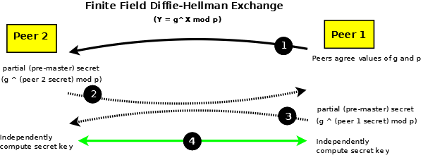
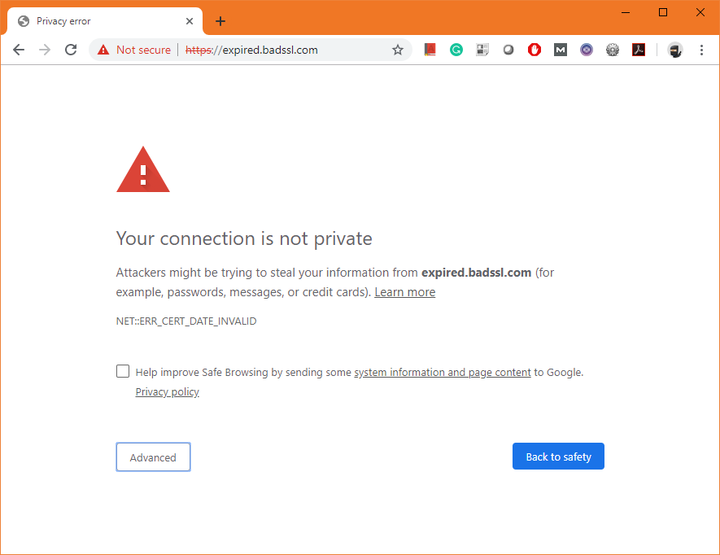

# *Short* Introduction to HTTPS, TLS and TLS certificates

<!-- TODOY: Donatation -->
<!-- TODOY: Contributions -->

How HTTP works, is well, but confusingly spreaded documented in the [MDN Web Docs](https://developer.mozilla.org/en-US/docs/Web/HTTP). You could also download [this text file](etc/Learning%20HTTP.txt) that includes all Mozilla HTTP pages (from 4th quarter of 2019) and related ones in an indentation based manner.

HTTPS however has just a [brief one paragraph page](https://developer.mozilla.org/en-US/docs/Glossary/https) simply because it dives into a completely different sphere of technologies very unrelated to the well known web technologies like HTML, CSS, JS etc.

We will explore the depths of hell in 9 sections:

1. [Internet Protocol Recap](#1-internet-protocol-recap)

2. [Browser to Website connection](#2-browser-to-website-connection)

3. [Introduction to HTTPS](#3-introduction-to-https)

4. [Cryptopgraphic Methods](#4-cryptopgraphic-methods)

    4.1. [Introduction to Cryptography](#41-introduction-to-cryptography)

    4.2. [Symmetric Cryptography](#42-symmetric-cryptography)

    4.3 [Asymmetric Cryptography](#43-asymmetric-cryptography)

    4.4. [Diffie-Hellman Exchange](#44-diffie-hellman-exchange)

    4.5. [Message Digests (Hashes)](#45-message-digests-hashes)

    4.6. [Message Authentication Code (MAC)](#46-message-authentication-code-mac)

    4.7. [Digital Signatures](#47-digital-signatures)

    4.8. [Forward Secrecy](#48-forward-secrecy)

5. [X.509 Certificate](#5-x509-certificate)

    5.1. [Introduction to X.509](#51-introduction-to-x509)

    5.2. [Certificate Structure](#52-certificate-structure)

    5.3. [Certificate Signature Structure](#53-certificate-signature-structure)

    5.4. [Verifying the Chain of Trust](#55-verifying-the-chain-of-trust)

    5.5. [Certificate File Formats and File Extensions](#56-certificate-file-formats-and-file-extensions)

    5.7. [Certificate Revocation](#57-certificate-revocation)

    5.8. [Certificate Handling by the Client](#58-certificate-handling-by-the-client)

    5.9. [Certificate Validation Failure](#59-certificate-validation-failure)

6. [TLS 1.2 in Detail](#6-tls-12-in-detail)

    6.1. [TLS 1.2 Full Handshake](#61-tls-12-full-handshake)

    6.2. [TLS 1.2 Abbreviated Handshake](#62-tls-12-abbreviated-handshake)

7. [TLS 1.3 in Detail](#7-tls-13-in-detail)

    7.1. [TLS 1.3 Full Handshake](#71-tls-13-full-handshake)

    7.2. [TLS 1.3 Session Resumption and PSK](#72-tls-13-session-resumption-and-psk)

    7.3. [TLS 1.3 0-RTT Data](#73-tls-13-0-rtt-data)

8. [Getting a Certificate](#8-getting-a-certificate)

9. [HTTP Strict Transport Security (HSTS)](#9-http-strict-transport-security-hsts)

A. [Glossary](#a-glossary)
B. [Sources](#b-sources)
C. [References](#c-references)

---

## 1. Internet Protocol Recap

Like you probably already know, data sent over the Internet means that the data is encapsulated in a packet of some protocol which is again encapsulated in a packet of some protocol until we reach the topmost layer. The Internet Protocol Suite has 4 layers of protocols.² Here is a list of the layers (from topmost to lowest) together with some protocols of interest for us:

1. Link layer - Ethernet

2. Internet Layer - IP, ICMP

3. Transport Layer - TCP, UDP

4. Application Layer - DNS, HTTP, HTTPS (TLS)

In most cases each protocol packet as a header with information necessary for the protocol followed by the data which again is a packet of some protocol:

    Protocol-Header [data]

    [Ethernet [IP [TCP [HTTP [HTML]]]]]

In the above Example an...

    Ethernet contains an
        IP packet which contains a
            TCP packet which contains an
                HTTP packet which contains
                    HTML.

For the Internet to work, the IP layer is important. Devices are identified by IP addresses that are set as the IP packet destination in the IP header. The packet is send from your device to a router and from their on from router to router until it reaches the requested destination (if it exists).³ The only interesting thing to note is, that there are two IP protocols in use, IPv4 and IPv6, which is referred to as dual-stack IP implementation.⁴ IPv6 was mainly developed because IPv4 addresses are only allowed to be 32 bit long which results in 4,294,967,296 unique addresses and this is by far not enough for more then nearly 8 billion people on earth.⁵ᐟ⁶

Now we take a look at what happens when a website is called in a browser...

---

## 2. Browser to Website connection

When a web address, which is a Uniform Resource Locator (URL) (e.g. `https://en.wikipedia.org/wiki/URL`), is entered into the address bar, the browser...

1. ...will parse the URL:

    - Here we assume that either `http` is explicitly specified as the URL scheme or that the scheme is not explicitly provided and assumed by the browser when calling the website. By default, browsers will then use HTTP.²⁰

    - We also assume that a valid hostname is provided, which mostly will be the domain name of the website we want to open.²¹

2. ...will resolve the servers IP address:⁷

    - The browser will send a Domain Name System (DNS) query to the DNS server currently configured on the operating system (OS) to get the IP address of the web server hosting the website.⁷

    - Because of dual-stack implementation, servers, including DNS servers, can have an IPv4 or IPv6 address or both. OSs mostly have both IPv4 and IPv6 addresses for a DNS server.⁸ The DNS server on the OS was either configured manually or came from messages of other protocols used during IPv4 and IPv6 address configuration.

    - The DNS IPv4 address can be send by a router in a Dynamic Host Configuration Protocol v4 (DHCPv4) Offer message which is send in the process of IPv4 address allocation.⁹ For IPv6, the DNS IPv6 address can be send by a router in a Neighbor Discovery Protocol (NDP) Router Advertisment message.¹⁰

    - Because of the dual-stack implementation, just like the DNS server, the web server can also have an IPv4 or IPv6 address or both. Browsers will use the "Happy Eyeballs" algorithm which specifies that seperate DNS queries (Type `A` and `AAAA`) should be send to request an IPv4 and IPv6 address of the web server.¹¹ᐟ¹² The first address that is returned should be used.¹¹

3. ...will send an HTTP GET request to the server:⁷

    - The IP destination address will be the servers address returned by a DNS query response.

    - Because HTTP is sent over TCP, a TCP connection must be established, which includes a 3 message exchange: `SYN (sent by client) => SYN-ACK (sent by server) => ACK (sent by client)`.¹³ The standard port used for HTTP requests is port 80.¹⁴

    - The server will (hopefully) receive the request and generate a response.¹⁵ Here is were web development does its magic by processing the request in many different mostly complicated ways...

4. ...will receive an HTTP response message sent back by the server:¹²

    - HTTP responses have different status codes.¹⁶ The outcome of what happens after the browser receives an HTTP response depends on the HTTP status code, HTTP headers and the content of the HTTP message.¹⁶

    - Assuming the server is configured for HTTP and not HTTPS, the response to the HTTP GET request will have a `2xx successful` status code which is most likely `200 OK`.¹⁶

    - If the HTTP response contains HTML (with JavaScript and CSS), the browser will parse and render the content which results in a beautiful or ugly website you see on screen.¹⁷

Now we have a brief understanding of what happens with HTTP. Of course the process can differ in many ways e.g. when the website got called before, the DNS query is not necessary because the browser cached the IP address.¹⁸ For HTTPS things will get terrifyingly complicated.

---

## 3. Introduction to HTTPS

> Hypertext Transfer Protocol Secure (HTTPS) is an extension of the Hypertext Transfer Protocol (HTTP).¹
>
> In HTTPS, the communication protocol is encrypted using Transport Layer Security (TLS) or, formerly, Secure Sockets Layer (SSL). The protocol is therefore also referred to as HTTP over TLS, or HTTP over SSL.¹
>
> Transport Layer Security (TLS), and its now-deprecated predecessor, Secure Sockets Layer (SSL), are cryptographic protocols designed to provide communications security over a computer network.¹

So, HTTPS is nothing more then encrypted HTTP contained in a TLS data packet which means the HTTP of the server does not change a bit (except for one tiny extension explained later):

    [Ethernet [IP [TCP [TLS [Encrypted HTTP]]]]]

Assuming the website was not accessed before, the browser does not know to use HTTPS when it is not used as the URL scheme and the domain is not in the preload list of the browser (more about that later). Just like before, the browser will then send an HTTP request. This also includes building up a new TCP connection with the default TCP port 80 for HTTP.

Assuming the server is user-friendly configured for HTTPS, it will send an HTTP redirect response (an HTTP response with a `3xx redirection` status code) with a new HTTPS `Location` specified, which the browser will follow.²²

Because the connection establishment is generic, from now on we call the browser a "client". As soon as the client is aware to use HTTPS the following process applies to establish an HTTPS connection:

1. First a TCP connection has to be established, just like for HTTP only for a different port. *TLS does not have a well-known TCP port number. Instead when used with a higher layer protocol, such as HTTP, that protocol designates a secure variant, HTTPS in the case of HTTP, which does have the well-known (or default) port number 443*.¹⁹

2. Because TLS was revised several times, multiple versions of that protocol exist. Here we will focus on the two latest ones, TLS 1.2 and TLS 1.3.²³ When a TCP connection is build up, a TLS connection has to be established. This process is called **Full Handshake** and requires multiple messages to be exchanged between the browser and the server.²⁴ᐟ²⁵ After the **Full Handshake** is finished, data can be exchanged encrypted which is the **Record Protocol** phase.²⁶ᐟ²⁷ The period in which data can be exchanged, in this case the **Record Protocol** phase, is called a session.⁴⁵ After a session has been closed (see list item 6.), a further session can get re-established with fewer messages and less data in an **Abbreviated Handshake** in TLS 1.2 and a **Session Resumption** in TLS 1.3.²⁸ᐟ²⁹

3. The TLS **Full Handshake** (in 1.2 and 1.3) starts with the client sending a TLS **ClientHello** message.²⁶ᐟ²⁷ The server (if things go well) will answer with a TLS **ServerHello** message.²⁶ᐟ²⁷ Both messages, **ClientHello** and **ServerHello**, are unencrypted but here is where the magic starts.²⁶ᐟ²⁷ The messages, **ClientHello** and **ServerHello**, have some fixed fields and extensions with values that are evaluated to decide the cryptographic methods and inherent parameter values for these methods used to secure some further messages and the session. ²⁵ᐟ²⁶ᐟ²⁷

4. When an unsecured website, that does not use HTTPS, is called, there is no certainty the site is trustworthy, the content presented is legal or even that the data reaches the right server. TLS addresses these issues by requiring the server to have a digital certificate which is "signed" by a higher authority.¹ᐟ³¹  The certificate is sent by the server in a TLS **Certificate** message following the **ServerHello**. The certificate includes information about the website and its owner.³² "Signed" means, a cryptographic method was applied that produced some bitstream which are appended to the certificate information and can be verified by the client.³³ TLS does allow the client to continue the connection when a certificate verification fails.¹²³ If a certificate is invalid, the browser will issue a warning, requiring the user to verify its intention to access the site.³⁴ Although using certificates to provide security is a nice idea, by June 2019 more then 50% of evil phishing sites used HTTPS with valid certificates.³¹

5. After completing the **Full Handshake**, the **Record Protocol** starts in which data is sent in an encrypted manner. Encryption algorithms used to secure the data have different parameters. If multiple data messages are sent and the parameters to encrypt the data stay the same, it is quite easy to imagine, that, if by some magic or theft of information, one encrypted message could be decrypted, the other messages can be decrypted as well.²⁷ᐟ³⁰ If the encryption parameters change for each session independent of previous sessions the encryption system is **forward secure**.³⁰ Both TLS 1.2 and TLS 1.3 provide the possibility to use encryption algorithms that allow **forward secrecy**, but TLS 1.3 goes event further by providing a way in which each message can be decrypted with different parameters.⁴⁶ᐟ²⁸ᐟ⁴⁷

6. A connection is closed with an `Alert` message of specific type in both TLS 1.2 and 1.3.³⁵ᐟ³⁶ At that time, the client will already have saved some necessary informaton to re-establish the connection with an **Abbreviated Handshake** in TLS 1.2 and a **Session Resumption** in TLS 1.3.²⁸ᐟ²⁹

Before getting into TLS more detailed, first we have to gain a little knowledge about the cryptographic methods used.

---

## 4. Cryptopgraphic Methods

### 4.1. Introduction to Cryptography

> In cryptography, **encryption** is the process of **encoding information**. This process converts the original representation of the information, known as **plaintext**, into an alternative form known as **ciphertext**.³⁷
>
> For technical reasons, an encryption scheme usually uses a **pseudo-random encryption key** generated by an algorithm.³⁷
>
> In cryptography, a **key** is a piece of information (a parameter) that determines the functional output of a cryptographic algorithm.³⁸ To prevent a **key** from being guessed, keys need to be generated truly randomly and contain sufficient entropy.⁴⁰ A **key** length of 80 bits is generally considered the minimum for strong security with symmetric encryption algorithms.³⁹

In the simplest form (**symmetric cryptography**), 4 things are necessary to encrypt and decrypt data:

1. **plaintext** => The data to be encrypted.

2. **key** => long random bitstream.

3. **encryption algorithm** => A method that gets the **plaintext** and the **key** as its parameters to produce an alternative unreadable form of the **plaintext**, the **ciphertext**.

4. **decryption algorithm** => A method that gets the **ciphertext** and the **key** as its parameters to reverse the unreadable **ciphertext** into the original **plaintext**.

Encryption algorithms should apply the assumption, that it is technically infeasible to decrypt the ciphertext without the key, which is called the **computational hardness assumption**.⁴¹

### 4.2. Symmetric Cryptography

> **Symmetric encryption** algorithms use a **single key** (or set of keys) to encrypt and decrypt the data. This **single key** - the **shared secret** - must be securely exchanged between the parties that will use it prior to the actual secure communication.⁴²

    

Fig. 1 - Symmetric Cryptography⁴³

Summary:

1. One peer creates and shares a secret key (**shared secret**) over a secure method.

2. Both peers use the **shared secret** to encrypt then send + to receive then decrypt **message**s.

### 4.3. Asymmetric Cryptography

> **Asymmetric encryption** algorithms use a **pair of keys** - a **public and a private key** - and are generally referred to as **public-key cryptographic systems**.⁴³
>
> In these systems, data (called plain-text in the jargon) that is encrypted with one key can only be decrypted with the paired key or vice versa. Given one key, it is computationally infeasible to derive the paired key.⁴³
>
> Asymmetric encryption works by making one key, called the **public key**, widely available, while maintaining the other key, surprisingly called the **private key**, a secret.⁴³
>
> Public-key systems have one significant limitation. They rely on knowing, or trusting, that the public key which will be used in communications with a person, organization or entity really is the public key of the person or organization and has not been spoofed by a malicious third party. Often a third party securely manages, and attests to the authenticity of, public keys.⁴³

    

Fig. 2 - Asymmetric Cryptography⁴³

Summary:

1. One peer creates a pair of **public** and **private** key.

2. The creator peer of the **public**-**private** key pair shares the **public key** over an insecure method.

3. A peer that wants to use the **public key** should verify it with help of some third party.

4. Now the **public key** can be used to decrypt data only to be encrypted with the **private key**. Or the **public key** can be used to encrypt data only to be decrypted with the **private key**.

### 4.4. Diffie-Hellman Exchange

> The **Diffie-Hellman exchange (DH)** is a method by which two (or in some case more) peers can independently create the same **shared secret** that may be subsequently used in a symmetric cryptographic algorithm.⁴⁴
>
> The original Diffie-Hellman Exchange (now frequently referred to as **Finite Field Diffie-Hellman**) uses exotic maths:⁴⁴
>
>     Y (shared secret) = g (generator) ^ x (secret key) mod p (prime modulator) ⁴⁴

    

Fig. 3 - Diffie-Hellman Exchange⁴⁴

1. The two peers share `p` and `g` publicly:⁴⁴

       g = 3, p = 17

2. Peer 2 then provides a partial result. First it creates a **private key** `s₂` and calculates a **pre-master secret** (also called **DH public value**) `x₂`...

       x₂ = g^s₂ mod p

    ...and sends that pre-master secret `x₂` to peer 1:⁴⁴

       s₂ = 15 => x₂ = 3^15 mod 17 = 6

3. Peer 1 also creates a **private key** `s₁`, calculates a **pre-master secret** `x₁` and sends it to peer 2:⁴⁴

       s₁ = 13 => x₁ = 3^13 mod 17 = 12

4. Now peer 1 and peer 2 are holding each others **pre-master secret** and can calculate the **shared secret** `Y`...⁴⁴

       Y = xₓ^sᵥ mod p

    ...without each other:⁴⁴

       Y = x₁^s₂ mod p = 12^15 mod 17 = 10

       Y = x₂^s₁ mod p = 6^13 mod 17 = 10

If the numbers for the calculation are high enough, an eavesdropping third party should not be able to decrypt the data in appropriate time.

> If both peers use the same private key every time, then if either key is discovered the current exchange and all previous exchanges can be decrypted. It is not, in the jargon, forward secure. To avoid this one or both of the peers can generate a new private key in every Diffie-Hellman Exchange. This is known as a **Ephemeral Diffie-Hellman** exchange (typically, and confusingly, abbreviated to **DHE**).⁴⁴

> Increasingly, algorithms other than Finite Field DH are being used, notably **Elliptic Curves** (**EC**). During the initial agreement (1) the curve type will be negotiated and then curve specific parameters publically exchanged. This is typically abbreviated to **(EC)DH** and if the exchange is ephemeral **(EC)DHE**.⁴⁴

Summary:

1. Both peers share **parameters** used for a Diffie-Hellman encryption algorithm.

2. Each peer creates a **private key** for themself and uses it to create a **pre-master secret**, also called **DH public key**, which is shared over an insecure method.

3. Each peer can then calculate the **shared secret** with its **private key** and the received **DH public key** of the other peer.

4. Both peers use the **shared secret** to encrypt then send + to receive then decrypt **message**s.

### 4.5. Message Digests (Hashes)

A **hash algorithm** creates a unique and relatively small fixed-size **digest** for a given message and is a one-way function, that is a function which is practically infeasible to invert.⁴⁸ᐟ⁴⁹

The digest is sent together with the message.⁴⁸ The hash algorithm is applied to the received message and, if the result matches the received digest, the receiver can be sure the message is unaltered.⁴⁸

If the message and the digest is sent unencrypted, it is obvious, that an attacker could alter the data and the digest so that the receiver would evaluate the received data as valid.⁴⁸

    

Fig. 4 - Message Digest or One-Way Hash⁴⁸ ⁽ᵃˡᵗᵉʳᵉᵈ⁾

Summary:

1. Run a **hash** algorithm over a **message**, the result is a "**digest**".

2. Send the **message** and the **digest** to the receiving peer.

3. The receiving peer runs the same **hash** algorithm over the **message**. If the **hashed message** equals the **digest**, the content is assumed unaltered.

### 4.6. Message Authentication Code (MAC)

> The process of authentication and data integrity can use what is called a **Message Authentication Code** (**MAC**). The **MAC** combines the message digest with a **shared (secret) key**. The key part authenticates the sender, and the hash (or digest) part ensures data integrity.⁵⁰

When the MAC is based on a hash algorithm, it is also called an **HMAC** (**Hash-based Message Authentication Code**).¹²⁵ The **secret key** is distributed over a secure method.⁵⁰ The message is processed by the hash algorithm to create a **TX Digest** which is then encrypted using the chosen algorithm and key.⁵⁰ The message and the encrypted **TX digest** is then sent to the recipient using an insecure method.⁵⁰ The recipient takes the message runs it through the (same) hash algorithm to create a **RX digest**.⁵⁰ The received **TX digest** is decrypted using the chosen algorithm and key.⁵⁰ The resulting **TX digest** compared with the **RX digest**.⁵⁰

> Equality = heaven, inequality = h.....orrible.⁵⁰

    

Fig. 5 - Message Authentication Code (MAC)⁵⁰ ⁽ᵃˡᵗᵉʳᵉᵈ⁾

Summary:

1. Share a **shared secret** over a secure method.

2. Run a **hash** algorithm over a **message**, the result is a **digest**. Encrypt the digest using the **shared secret**:

       digest = hash(message);
       encrypted_digest = encrypt(digest, shared_secret);

3. Send the **message** and the **encrypted digest** over an insecure method to the receiving peer.

4. The receiving peer runs the same **hash** algorithm over the **message**, which again is the **digest**. The recipient decrypts the received **encrypted digest** with the **shared secret** and checks if it equals the self-calculated **digest**:

       digest = hash(message);
       if(digest == decrypt(encrypted_digest, shared_secret)) {
           Message is unaltered...
       }

### 4.7. Digital Signatures

> In the asymmetric or public-key world, the process of authentication and data integrity uses what is called a **digital signature**. The message being sent is again hashed to create a message **digest** to ensure data integrity.⁵¹

The resulting message **digest** is then encrypted using the **private key** of the sender which is the **digital signature**. Both the message and the encrypted digest, as the signature, are sent to the receiving party. The receiver decrypts the signature using the **public key** of the sender, applies the hash algorithm to the message, and, if the results match, both the authenticity of the sender and the integrity of the data are assured.⁵¹

So while anyone can decrypt the message and recover the digest using the universally available public key, only the possessor of the private key can encrypt it - thus proving the authenticity of the source.⁵¹

> The underlying digest provides the message integrity and, since it is encrypted by the senders private key, cannot be modified in transit.⁵¹

    

Fig. 6 - Digital Signature⁵¹ ⁽ᵃˡᵗᵉʳᵉᵈ⁾

Summary:

1. One peer creates a **public**-**private** key pair and shares the **public key**.

2. The creating peer of the **public**-**private** key pair runs a hash algorithm over the **message**, the result is a **digest**, then encrypts the **digest** with the **private key** which results in the **signature**:

       digest = hash(data);
       signature = encrypt(digest, private_key);

3. The creating peer of the **public**-**private** key pair sends the **message** and the **signature** to the receiving peer.

4. The receiving peer runs the same hash algorithm over the **message**, again the result is the **digest**, then decrypts the **signature** with the **public key** and checks if it equals the calculated **digest**:

       digest = hash(data);
       if(digest == decrypt(signature, public_key)) {
           Data is unaltered...
       }

### 4.8. Forward Secrecy

Although the term **forward secrecy** is used in a bunch of RFCs including the ones for TLS 1.2 and 1.3, there is no official definition and the one in wikipedia is borked.¹⁵³ᐟ²⁸ᐟ¹⁹⁹ᐟ²²³ Therefore i've decided to do a definition myself:

> An encrpytion system has the property of **forward secrecy** (also known as **perfect forward secrecy**) if an exposure of session data and encryption attributes, including encryption keys, does not give away encryption attributes which help to reveal other sessions.

Let's take **asymmetric encryption** as an example: The server has its public-private key pair and sends its public key to the client. The client then creates a symmetric key, encrypts it with the public key of the server and sends the encrypted symmetric key to the server. With the assumption, that it is technically infeasible to decrypt the encrypted message, which includes the symmetric key from the client, this is a safe method to share encryption attributes for a session.

With the assumption that the server will not change the public-private key pair, an attacker who stored the data exchange of past sessions is able to encrypt these, once the private key gets revealed. The attacker can use the private key to encrypt the symmetric key for each session and then encrypt the sessions with the symmetric keys. Therefore this encryption system would not be **forward secure**.

Now let's assume the server would create a new public-private key pair for each client/session and makes sure that past key pairs are completely removed from any memory. Now, if one private key gets revealed by an attacker, past sessions can not get encrypted because the corresponding private key is long gone, the attacker would of course be able to save the public key send to the client. This encryption system would be **forward secure** because the necessary encryption attributes of past sessions do not exist anymore.

The encryption system provided in the example is not used in TLS 1.2 and TLS 1.3. The only **forward secure** encryption systems that are used in TLS 1.2 and TLS 1.3 are **DHE** and **ECDHE**: As shown in [section 4.4.](#44-diffie-hellman-exchange), for **DHE**, both peers share a new **DH public key** for each session, but because each of the **DH public key**s has a corresponding **private key**, an attacker is not able to resolve the **shared secret** which is used to encrypt the session. Even if an attacker gets hold of one **shared secret**, past sessions are not compromised because they used a different **shared secret**.

There is the concept of session resumption in both TLS 1.2 and TLS 1.3.¹²⁶ᐟ²⁸ In TLS 1.2, the encryption attributes do not change when a session is resumed.¹²⁶ In TLS 1.3, session resumption may include a so called **pre shared key** (**PSK**) that is send in the initial handshake, but because the message that includes the **PSK** is encrypted with the same encryption attributes for the application data of the initial session, it really doesn't enforce any more security, just an extra step to calculate the session keys.²²⁰ᐟ²⁸ Therefore in both TLS 1.2 and 1.3, resumed sessions really can be seen as belonging to the initial session.

---

## 5. X.509 Certificate

### 5.1. Introduction to X.509

**X.509** is the standard defining the format of public key certificates used for TLS.⁵² **X.509** certificates are sent by the server in a TLS **Certificate** message.²⁴ The procedure of handling **X.509** certificates is basically the same in both TLS 1.2 and 1.3, just the usage of keys differs.⁵³ᐟ⁵⁴ Certificates are used to verify the relation between the certificate and its owner and also to encrypt/sign specific TLS messages.⁵²ᐟ⁵⁵ᐟ⁵⁶

> An **X.509** certificate is an **ASN.1** (X.680) structure encoded using the **Distinguished Encoding Rules** (**DER**) of X.690...⁵⁷

**ASN.1** stands for **Abstract Syntax Notation One** and *is a standard interface description language for defining data structures that can be serialized and deserialized in a cross-platform way*.⁵⁸ The data structures are human readable and called **module**s where each **module** has a set of **field**s.⁵⁸ **Field**s can be scalar values or other **module**s.⁵⁹ᐟ⁶⁰

The **DER** are one of three **ASN.1** encoding formats specified in the **X.609** standard.⁶¹ More specifically **DER** is a restricted variant of the **Basic Encoding Rules** (**BER**), a type-length-value encoding.⁶²ᐟ⁶³

> This is an example **ASN.1** module defining the messages (data structures) of a fictitious **Foo Protocol**:
>
>     FooProtocol DEFINITIONS ::= BEGIN
>
>         FooQuestion ::= SEQUENCE {
>             trackingNumber INTEGER,
>             question       IA5String
>         }
>
>         FooAnswer ::= SEQUENCE {
>             questionNumber INTEGER,
>             answer         BOOLEAN
>         }
>
>     END
>
> Assuming a message that complies with the **Foo Protocol** and that will be sent to the receiving party, this particular message (**protocol data unit** (**PDU**)) is:
>
>     myQuestion FooQuestion ::= SEQUENCE {
>         trackingNumber     5,
>         question           "Anybody there?"
>     }
>
> Below is the data structure shown above encoded in **DER** format (all numbers are in hexadecimal):
>
>     30 13 02 01 05 16 0e 41 6e 79 62 6f 64 79 20 74 68 65 72 65 3f
>
> **DER** is a type-length-value encoding, so the sequence above can be interpreted, with reference to the standard `SEQUENCE`, `INTEGER`, and `IA5String` types, as follows:
>
>     30 — type tag indicating SEQUENCE
>     13 — length in octets of value that follows
>       02 — type tag indicating INTEGER
>       01 — length in octets of value that follows
>         05 — value (5)
>       16 — type tag indicating IA5String
>          (IA5 means the full 7-bit ISO 646 set, including variants,
>           but is generally US-ASCII)
>       0e — length in octets of value that follows
>         41 6e 79 62 6f 64 79 20 74 68 65 72 65 3f — value ("Anybody there?")
⁶⁴

### 5.2. Certificate Structure

The **X.509** version 3 (`X509v3`) certificate module definition is as follows:⁵⁹

    TBSCertificate  ::=  SEQUENCE  {
          version         [0]  Version DEFAULT v1,
          serialNumber         CertificateSerialNumber,
          signature            AlgorithmIdentifier{SIGNATURE-ALGORITHM,
                                    {SignatureAlgorithms}},
          issuer               Name,
          validity             Validity,
          subject              Name,
          subjectPublicKeyInfo SubjectPublicKeyInfo,
          ... ,
          extensions      [3]  Extensions{{CertExtensions}} OPTIONAL,
          ... }

Some of the **ASN.1** modules used in the `TBSCertificate` module include the usage of globally unique Object Identifiers (**OID**s) which are standardized by the *International Telecommunications Union* (ITU) e.g. the key usage extension:⁵⁷ᐟ⁶⁵ᐟ⁵⁹ᐟ⁶⁶

    ext-KeyUsage EXTENSION ::= { SYNTAX
        KeyUsage IDENTIFIED BY id-ce-keyUsage }
    id-ce-keyUsage OBJECT IDENTIFIER ::=  { id-ce 15 }

Here `SYNTAX KeyUsage IDENTIFIED BY id-ce-keyUsage` and `id-ce-keyUsage ...` specifies that the syntax and the values are standardized with the **OID** description `id-ce-keyUsage`.⁵⁹ᐟ⁶⁶ᐟ⁶⁷ The **OID** description `id-ce-keyUsage` belongs to the **OID** `2.5.29.15`.⁶⁷ᐟ⁶⁸ For the **OID** `2.5.29.15`, syntax and valid values are specified as follows:⁵⁹

    keyUsage EXTENSION ::= {
    	SYNTAX KeyUsage
    	IDENTIFIED BY id-ce-keyUsage
    }

    KeyUsage ::= BIT STRING {
    	digitalSignature(0),
    	nonRepudiation(1),
    	keyEncipherment(2),
    	dataEncipherment(3),
    	keyAgreement(4),
    	keyCertSign(5),
    	cRLSign(6)
    }

As you can see, for the key usage extension, only a number of predefined choices can be used. A certificate that does not apply the syntax and values of the **OID** specification is not valid and will not be signed.⁶⁹

Some of the `TBSCertificate` field value types are **Distinguished Name**s (**DN**s). A **DN** consists of multiple **Relative Distinguished Name**s (**RDNs**), each of which is a data-containing element called an attribute with a corresponding value:⁵⁵ᐟ⁵²

    Subject: C=US, ST=California, L=San Francisco, O=Wikimedia Foundation, Inc., CN=*.wikipedia.org

A **DN** can have the following **RDN**s:⁵⁵

- `CN=` commonName e.g. www.example.com

- `C=` country

- `ST=` state or province within country

- `L=` location, nominally an address but ambiguously used

- `OU=` organizationalUnitName, a company division name or similar sub-structure

- `O=` organizationName, typically a company name

The comma seperated list of **RDN**s makes the **DN** (e.g. `C=US, ST=Calif...`).⁷¹

The `TBSCertificate`'s most import fields are the following:⁵⁹

- `signature`:

    An **X.509** certificate is digitally signed by the `issuer` with its private key (see below).⁷² The value of this field identifies the signature algorithm used for the digital signature.⁷³

- `issuer`:

    A **DN** identifying the **trusted authority** that digitally signed the certificate.⁷² **Trusted authorities** are explained in [section 5.4.](#54-certificate-chain).

- `validity`:

    Specifies a time period in which the certificate is valid with the sub-fields `notBefore` and `notAfter`.⁷⁴

- `subject`:

    A **DN** defining the entity (holder) of the certificate. The `CN=` **RDN** includes the domain name e.g. `www.example.com`.⁷⁵ The `CN` value can also make use of wildcards e.g. `*.wikipedia.org`, so that the certificate also verifies all subdomains making it a *wildcard certificate*.⁷⁶

- `subjectPublicKeyInfo`:

    Contains the public key of a specific public-private key pair where the private key is hold by the `subject` entity.⁷⁷ᐟ⁵⁵ᐟ⁶⁹ The public key must be compatible with the key exchange algorithm used by TLS.⁵³ In TLS 1.2 the server might use the private key belonging to this public key to sign message contents.²⁹ᐟ⁷⁸ᐟ⁷⁹

    This field is build of two sub-fields:⁵⁹

    - `algorithm`:

        Identification of the public key algorithm via **OID**.⁵⁷

    - `subjectPublicKey`:

        The public key as a bit string.⁵⁷

 - `extensions`:

    Notable extension fields for **X.509** version 3:⁵⁹

    - `SubjectAltName`:

        `SubjectAltName` stands for **Subject Alternative Name** (**SAN**).⁸⁰

        May include alternative names for the subject, therefore making it a *multi-domain certificate*.⁸⁰ᐟ⁷⁶ More specifically the `SubjectAltName` value is a list with multiple attribute value pairs.⁸⁰ᐟ⁵⁷ For alternative domain names, the `dNSName` attribute is used and values are not limited to subdomains.⁸⁰ᐟ⁵⁷ᐟ⁷⁶

        For example `subject` `CN` could be `www.example.com` and `SubjectAltName` could have multiple `dNSName` value pairs:

          dNSName=example.net,
          dNSName=example.com

    - `KeyUsage`:

        The `KeyUsage` extension defines the purpose of the key contained in the certificate.⁶⁶ᐟ⁵⁷ As already shown above, the values for `KeyUsage` are standardized by an **OID** with the description `id-ce-keyUsage`.⁶⁷ᐟ⁶⁸

    - `BasicConstraints`:

        The `BasicConstraints` extension identifies whether the subject of the certificate is a so called **certificate authority** (**CA**), an organisation that is allowed to sign certificates to users and other organisations.⁸¹ᐟ⁸²ᐟ⁷⁶ It also specifies the maximum number of non-self-issued **intermediate certificate**s that may follow this certificate in a valid certification path.⁸¹ You will learn about **CA**s and **intermediate certificate**s in [section 5.4](#54-certificate-chain).

          BasicConstraints ::= SEQUENCE {
               cA                      BOOLEAN DEFAULT FALSE,
               pathLenConstraint       INTEGER (0..MAX) OPTIONAL
          }   

### 5.3 Certificate Signature Structure

The whole **DER** encoded `TBSCertificate` value is used for the digital signature created with the private key of the certificate's `issuer`:⁸³ᐟ⁵⁹ᐟ⁸⁴ᐟ⁸⁵

    Certificate  ::=  SIGNED{TBSCertificate}

    SIGNED{ToBeSigned} ::= SEQUENCE {
      toBeSigned  ToBeSigned,
      algorithm   AlgorithmIdentifier{SIGNATURE-ALGORITHM,
                      {SignatureAlgorithms}},
      signature   BIT STRING
    }

`SIGNED` is just one of three different signature versions.⁵⁹ The main point is, that the `TBSCertificate` module is embedded in a `SIGNED` module where the `signature` lies, which builds the **Certificate** module, therefore the whole certificate information is used for the signature.

As you might notice, both `TBSCertificate` and `SIGNED` have a field to specify a signature algorithm (`TBSCertificate::signature` and `SIGNED::algorithm`). The algorithm of the `TBSCertificate` should be the same as the one in the **Certificate** (`SIGNED`) module to protect against *algorithm substitution attacks*.⁸⁶ᐟ⁸⁷

### 5.4. Certificate Chain

The `issuer` of a certificate identifies a *trusted authority* that signed the certificate with its private key.⁷² Logically if we do not trust the `subject` of a certificate, we shouldn't trust the `issuer` which means the `issuer` must be verified as well. Just like the server has a certificate identified by the `subject` field, an `issuer` also has a certificate that is signed by a higher authority creating a chain of certificates signed by higher authorities until we reach a self-signed **root certificate**.⁵⁵ᐟ⁸⁸ᐟ⁸⁹ᐟ⁹⁰ This is also called the **chain of trust** in which each certificate *certifies* the next.⁵⁵ᐟ⁸⁸ᐟ⁸⁹ᐟ⁹⁰ The **chain of trust** has the following kinds of certificates:

1. **Root Certificate**:⁸⁸ᐟ⁹¹

    The *highest* certificate in the chain of trust:⁸⁸ A **root certificate** is a self-signed certificate issued by a so called **Certificate Authority** (**CA**) and is distributed by a trusted out-of-band process, mostly **root certificate**s are included in browsers and therefore distributed when a browser gets installed or updated.⁷⁶ᐟ⁸⁸ᐟ³² **Root certificate**s distributed in this way are generically called *trust anchors*.⁸⁴ᐟ⁸⁵

    Self-signed means, that the certificate is created and signed by the **CA** alone.⁸⁵ᐟ⁹¹ᐟ⁷⁶ The signature is created with the private key belonging to the public key that is part of the certificate.⁸⁵ᐟ⁹¹ᐟ⁷⁶ A **root certificate** has the following notable characteristics:

    - The `subject` equals the `issuer` and identifies the **CA**.⁸⁵ᐟ⁹¹

    - The public key of the certificate belongs to the private key that was used to create the certificate's signature.⁸⁵ᐟ⁹¹ Therefore the signature can be verified with the certificate's public key.⁸⁵ᐟ⁹¹

    - The `BasicConstraints` extension has the `cA` field value set `TRUE`.⁸¹

    - Optionally, the `KeyUsage` extension has the `keyCertSign` value set.⁶⁶ᐟ⁵⁷

    **CA**s are deemed to be trusted organisations that are allowed to issue certificates of lower level to other organisations.⁸²ᐟ⁸⁵ As already noted, **root certificate**s are distributed by a trusted out-of-band process.⁷⁶ᐟ⁸⁸ᐟ³² More specifically, **root certificate**s are distributed as part of operating systems and browsers.⁸⁸ᐟ³² An organisation that wants to become a **CA** must therefore apply to **Root Certificate Program**s of big organisations, most notably:⁹²

    - [Microsoft Root Certificate Program](https://docs.microsoft.com/en-us/security/trusted-root/program-requirements) to get a **root certificate** in Windows software.

    - [Apple Root Certificate Program](https://www.apple.com/certificateauthority/ca_program.html) to get a **root certificate** in Apple software.

    - [Mozilla Root Certificate Program](https://wiki.mozilla.org/CA) to get a **root certificate** in Mozilla software but is also used by Chrome on Linux.

    **CA**s come in the form of commercial and non-profit organisations.⁹³ To become a **CA**, an organisation has to conform to an extensive set of security related criteria and undergo an annual audit process, therefore they are deemed to be "trustworthy".⁹⁴ᐟ⁹⁵ᐟ⁹⁶ᐟ⁹⁷ However there have been cases in which **CA**s have been hacked which resulted in wrongfully issued certificates.⁹⁸ᐟ⁹⁹

    Example of a **root certificate** printed with OpenSSL (field names differ from standard):⁹¹ᐟ¹⁰⁰

    >     Certificate:
    >         Data:
    >             Version: 3 (0x2)
    >             Serial Number:
    >                 04:00:00:00:00:01:15:4b:5a:c3:94
    >             Signature Algorithm: sha1WithRSAEncryption
    >             Issuer: C=BE, O=GlobalSign nv-sa, OU=Root CA, CN=GlobalSign Root CA
    >             Validity
    >                 Not Before: Sep  1 12:00:00 1998 GMT
    >                 Not After : Jan 28 12:00:00 2028 GMT
    >             Subject: C=BE, O=GlobalSign nv-sa, OU=Root CA, CN=GlobalSign Root CA
    >             Subject Public Key Info:
    >                 Public Key Algorithm: rsaEncryption
    >                     Public-Key: (2048 bit)
    >                     Modulus:
    >                         00:da:0e:e6:99:8d:ce:a3:e3:4f:8a:7e:fb:f1:8b:
    >                         ...
    >                     Exponent: 65537 (0x10001)
    >             X509v3 extensions:
    >                 X509v3 Key Usage: critical
    >                     Certificate Sign, CRL Sign
    >                 X509v3 Basic Constraints: critical
    >                     CA:TRUE
    >                 X509v3 Subject Key Identifier:
    >                     60:7B:66:1A:45:0D:97:CA:89:50:2F:7D:04:CD:34:A8:FF:FC:FD:4B
    >         Signature Algorithm: sha1WithRSAEncryption
    >              d6:73:e7:7c:4f:76:d0:8d:bf:ec:ba:a2:be:34:c5:28:32:b5:
    >              ...    

2. **Intermediate Certificate**:⁷⁶ᐟ⁸⁸

    **Intermediate Certificate**s are all certificates in the chain of trust below the **root certificate** that are not issued for a web server directly.⁷⁶ Like every other certificate, **intermediate certificate**s have a public-private key pair.¹⁰¹ The highest **intermediate certificate** is signed with the private key of the **root certificate**, while all **intermediate certificate**s below are signed with the private key of the next higher certificate in the chain.⁸⁸ᐟ⁸⁹

    The idea is, that **CA**s give up the authority to assure valid and correct certificate requests to so called **Registration Authority**s (**RA**s), also called **Subordinate CA**s.⁵⁵ᐟ⁷⁶ *An RA is responsible for accepting requests for digital certificates and authenticating the entity making the request*.¹⁰²

    An **intermediate certificate** has the following notable characteristics:

    - The `subject` identifies the **RA**.⁷⁵ᐟ⁵⁵

    - The `issuer` identifies the autority of the next higher certificate, either a **CA** or another **RA**.⁷²ᐟ⁸⁸ᐟ⁵⁷

    - The signature is created with a private key belonging to the `issuer`, the owner of the next higher certificate, whose public key can be used to verify the **intermediate certificate**.⁷²

    - The `cA` field of the `BasicConstraints` extension can be set `TRUE` or `FALSE`.

    There is also the concept of **cross certificate**s:⁸⁸ᐟ⁸⁹

    -
        **Cross certificate**s are **intermediate certificate**s of a **CA** where the `issuer` is another **CA** and the `cA` field of the `BasicConstraints` extension is set `TRUE`.⁷⁶ᐟ⁸⁹

        They are called **cross certificate**s because each **CA** has its own system for the creation, storage, and distribution of certificates, called a **public key infrastructure** (**PKI**) which is *crossed* when the `issuer` is another **CA**.⁷⁶ᐟ⁸⁹ᐟ⁸⁸

    Example of an **intermediate certificate** printed with OpenSSL:¹⁰¹

    >     Certificate:
    >         Data:
    >             Version: 3 (0x2)
    >             Serial Number:
    >                 04:00:00:00:00:01:44:4e:f0:42:47
    >             Signature Algorithm: sha256WithRSAEncryption
    >             Issuer: C=BE, O=GlobalSign nv-sa, OU=Root CA, CN=GlobalSign Root CA
    >             Validity
    >                 Not Before: Feb 20 10:00:00 2014 GMT
    >                 Not After : Feb 20 10:00:00 2024 GMT
    >             Subject: C=BE, O=GlobalSign nv-sa, CN=GlobalSign Organization Validation CA - SHA256 - G2
    >             Subject Public Key Info:
    >                 Public Key Algorithm: rsaEncryption
    >                     Public-Key: (2048 bit)
    >                     Modulus:
    >                         00:c7:0e:6c:3f:23:93:7f:cc:70:a5:9d:20:c3:0e:
    >                         ...
    >                     Exponent: 65537 (0x10001)
    >             X509v3 extensions:
    >                 X509v3 Key Usage: critical
    >                     Certificate Sign, CRL Sign
    >                 X509v3 Basic Constraints: critical
    >                     CA:TRUE, pathlen:0
    >                 X509v3 Subject Key Identifier:
    >                     96:DE:61:F1:BD:1C:16:29:53:1C:C0:CC:7D:3B:83:00:40:E6:1A:7C
    >                 X509v3 Certificate Policies:
    >                     Policy: X509v3 Any Policy
    >                       CPS: https://www.globalsign.com/repository/
    >    
    >                 X509v3 CRL Distribution Points:
    >    
    >                     Full Name:
    >                       URI:http://crl.globalsign.net/root.crl
    >    
    >                 Authority Information Access:
    >                     OCSP - URI:http://ocsp.globalsign.com/rootr1
    >    
    >                 X509v3 Authority Key Identifier:
    >                     keyid:60:7B:66:1A:45:0D:97:CA:89:50:2F:7D:04:CD:34:A8:FF:FC:FD:4B
    >    
    >         Signature Algorithm: sha256WithRSAEncryption
    >              46:2a:ee:5e:bd:ae:01:60:37:31:11:86:71:74:b6:46:49:c8:
    >              ...    

3. **End-Entity Certificate**:⁷⁶ᐟ⁵⁵ᐟ⁸⁸

    An **end-entity certificate** is the certificate of an **end-entity** (**EE**), that is the entity, such as a web server, that is meant to be verified with the chain of trust, merely the purpose of the whole certificate *effort*.⁷⁶ An **end-entity certificate** can not be used to sign other certificates.⁷⁶

    An **end-entity certificate** has the following notable characteristics:

    - The `subject` identifies the **EE**.⁷⁶

    - The `issuer` identifies the autority of the next higher certificate, either a **CA** or an **RA**.⁷²ᐟ⁸⁸ᐟ⁵⁷

    - The signature is created with a private key belonging to the `issuer`, the owner of the next higher certificate, whose public key can be used to verify the **end-entity certificate**.⁷²ᐟ⁸⁸

    - The `cA` field of the `BasicConstraints` extension is set `FALSE`.⁸¹

    Because **end-entity certificate**s are the lowest certificates in the **chain of trust**, they are also called **leaf certificate**s.⁷⁶

    Example of an **end-entity certificate** printed with OpenSSL:⁹

    >     Certificate:
    >         Data:
    >             Version: 3 (0x2)
    >             Serial Number:
    >                 10:e6:fc:62:b7:41:8a:d5:00:5e:45:b6
    >             Signature Algorithm: sha256WithRSAEncryption
    >             Issuer: C=BE, O=GlobalSign nv-sa, CN=GlobalSign Organization Validation CA - SHA256 - G2
    >             Validity
    >                 Not Before: Nov 21 08:00:00 2016 GMT
    >                 Not After : Nov 22 07:59:59 2017 GMT
    >             Subject: C=US, ST=California, L=San Francisco, O=Wikimedia Foundation, Inc., CN=*.wikipedia.org
    >             Subject Public Key Info:
    >                 Public Key Algorithm: id-ecPublicKey
    >                     Public-Key: (256 bit)
    >                 pub:
    >                         00:c9:22:69:31:8a:d6:6c:ea:da:c3:7f:2c:ac:a5:
    >                         af:c0:02:ea:81:cb:65:b9:fd:0c:6d:46:5b:c9:1e:
    >                         9d:3b:ef
    >                     ASN1 OID: prime256v1
    >                     NIST CURVE: P-256
    >             X509v3 extensions:
    >                 X509v3 Key Usage: critical
    >                     Digital Signature, Key Agreement
    >                 Authority Information Access:
    >                     CA Issuers - URI:http://secure.globalsign.com/cacert/gsorganizationvalsha2g2r1.crt
    >                     OCSP - URI:http://ocsp2.globalsign.com/gsorganizationvalsha2g2
    >                 X509v3 Certificate Policies:
    >                     Policy: 1.3.6.1.4.1.4146.1.20
    >                       CPS: https://www.globalsign.com/repository/
    >                     Policy: 2.23.140.1.2.2
    >                 X509v3 Basic Constraints:
    >                     CA:FALSE
    >                 X509v3 CRL Distribution Points:
    >                     Full Name:
    >                       URI:http://crl.globalsign.com/gs/gsorganizationvalsha2g2.crl
    >                 X509v3 Subject Alternative Name:
    >                     DNS:*.wikipedia.org, DNS:*.m.mediawiki.org, DNS:*.m.wikibooks.org, DNS:*.m.wikidata.org, DNS:*.m.wikimedia.org, DNS:*.m.wikimediafoundation.org, DNS:*.m.wikinews.org, DNS:*.m.wikipedia.org, DNS:*.m.wikiquote.org, DNS:*.m.wikisource.org, DNS:*.m.wikiversity.org, DNS:*.m.wikivoyage.org, DNS:*.m.wiktionary.org, DNS:*.mediawiki.org, DNS:*.planet.wikimedia.org, DNS:*.wikibooks.org, DNS:*.wikidata.org, DNS:*.wikimedia.org, DNS:*.wikimediafoundation.org, DNS:*.wikinews.org, DNS:*.wikiquote.org, DNS:*.wikisource.org, DNS:*.wikiversity.org, DNS:*.wikivoyage.org, DNS:*.wiktionary.org, DNS:*.wmfusercontent.org, DNS:*.zero.wikipedia.org, DNS:mediawiki.org, DNS:w.wiki, DNS:wikibooks.org, DNS:wikidata.org, DNS:wikimedia.org, DNS:wikimediafoundation.org, DNS:wikinews.org, DNS:wikiquote.org, DNS:wikisource.org, DNS:wikiversity.org, DNS:wikivoyage.org, DNS:wiktionary.org, DNS:wmfusercontent.org, DNS:wikipedia.org
    >                 X509v3 Extended Key Usage:
    >                     TLS Web Server Authentication, TLS Web Client Authentication
    >                 X509v3 Subject Key Identifier:
    >                     28:2A:26:2A:57:8B:3B:CE:B4:D6:AB:54:EF:D7:38:21:2C:49:5C:36
    >                 X509v3 Authority Key Identifier:
    >                     keyid:96:DE:61:F1:BD:1C:16:29:53:1C:C0:CC:7D:3B:83:00:40:E6:1A:7C
    >    
    >         Signature Algorithm: sha256WithRSAEncryption
    >              8b:c3:ed:d1:9d:39:6f:af:40:72:bd:1e:18:5e:30:54:23:35:
    >              ...    

    

Fig. 7 - X.509 certificate chain⁸⁸ ⁽ᵃˡᵗᵉʳᵉᵈ⁾

### 5.5. Verifying the Chain of Trust

Certificates in the **chain of trust** are signed by a higher authority (except for the **root certificate**) identified by the `issuer`.⁷²ᐟ⁸⁸ The authority will hash the **DER** encoded `TBSCertificate` value and encrypt the hash with the specified encryption algorithm using its own private key, like described in section [**4.7. Digital Signatures**](#47-digital-signatures):⁹⁰ᐟ⁵¹

    digest = hash(encodedTbsCertValue);
    signature = encrypt(digest, issuer_private_key);

The algorithm used to create the public-private key pair is specified in the `subjectPublicKeyInfo` field of the `TBSCertificate` module together with the public key.⁵⁹ᐟ⁵⁷ The signature algorithm which uses the public-private key pair to sign the certificate is specified in the `AlgorithmIdentifier` somewhere in the `SIGNED` module.¹⁰³ Like described earlier, there are 3 versions of `SIGNED` specified.⁵⁹

Both, the public key algorithm and the signature algorithm are identified by a registered **OID**.⁵⁹ᐟ⁵⁷ᐟ¹⁰³ The signature algorithm specifies both, the hash and the encryption/decryption algorithm used.¹⁰⁴ Many but not all algorithms can be found under the **OID** `1.2.840.113549.1.1` e.g. `sha256WithRSAEncryption` (OID: `1.2.840.113549.1.1.11`) specifies that `sha256` is used to create the hash of the certificate and `RSAEncryption` is used to encrypt the created hash with the private key of the `issuer`.¹⁰⁵ **RSA** is a cryptosystem used for both, encryption and decryption.¹⁰⁶

If the **end-entity certificate**'s `issuer` is not a **CA**, therefore the certificate does not *point* to a **root certificate**, all certificates below the **root certificate** are often packaged in a **certificate bundle**.⁷⁶ᐟ¹⁰⁷ A **certificate bundle** is a single file with multiple certificates.⁷⁶ᐟ¹⁰⁷ The **certificate bundle** file will probably contain the certificates in the order in which they need to be verified from the **end-entity certificate** to the last **intermediate certificate**.⁷⁶ᐟ¹⁰⁷ The **certificate bundle** files are used in server software like **Apache** or **nginx** to provide them for the TLS connection.²³²ᐟ²²²ᐟ²³³ Certificates provided via the TLS **Certificate** message must contain the certificates from the **end-entity certificate** to the highest certificate in the chain. The **root certificate** may be omitted because it should already be in possession by the client.¹³⁹ᐟ⁵⁴ Logically, the **end-entity** can always be identified with the `subject` and `subjectAltName` values and the `issuer` is the `subject` of the next higher certificate.

All certificates in the **chain of trust**, from the **end-entity certificate** to the **root certificate**, have to be verified by the browser during the TLS **Handshake** by hashing the **DER** encoded `TBSCertificate` value and decrypting the signature with the specified decryption algorithm, using the public key of the `issuer`'s certificate, which is the next higher certificate in the chain:⁸⁸ᐟ⁵¹

    digest = hash(encodedTbsCertValue);
    if(digest == decrypt(signature, issuer_public_key)) {
        Data is unaltered...
    }

Therefore the public key of the **end-entity certificate** is not directly used in any verification process.⁷⁶

### 5.6. Certificate File Formats and File Extensions

Certificates and associated keys come in a bunch of different file formats with two different encodings:¹⁰⁸

1. **DER** encoded as described in the first section.¹⁰⁸ **DER** files can NOT be opened with text editors because they are binary (of course they can be opened with binary text editors).¹⁰⁸ᐟ¹⁰⁹

2. **Privacy Enhanced Mail** (**PEM**) encoded.¹⁰⁸ᐟ¹¹⁰ **PEM** encodes binary **DER** in **base64**, creating a text version (**ASCII**).¹⁰⁸ᐟ¹¹⁰ Objects encoded by PEM include header lines and trailer lines each starting and finishing with precisely 5 dashes to encapsulate the base64 material and provide a human readable indication of its content:¹¹⁰

       -----BEGIN CERTIFICATE-----
       MIIDHDCCAoWgAwIBAgIJALt8VJ...
       ...
       Cfh/ea7F1El1Ym1Zj2v3wLhRl1...
       NH5lEmZybl+m2frlkjUv9KAvxc...
       IFgovdU8YPMDds=
       -----END CERTIFICATE-----        

    Official supported keywords like `CERTIFICATE` and legitimate content are mostly specified in RFC 7468.¹¹¹ Again, the content is **PEM** encoded (**base64** of **DER** encoded content):¹¹¹

    - `CERTIFICATE`:

        Single X.509 certificate.

    - `PKCS7`:

        Contains **Cryptographic Message Syntax** (**CMS**) container which may include multiple certificates. **PKCS** and **CMS** is explained in the next paragraph.

    - `CMS`:

        Again **CMS** container.

    - `PRIVATE KEY`:

        Unencrypted private key in **PKCS#8** container.

    - `ENCRYPTED PRIVATE KEY`:

        Encrypted private key in **PKCS#8** container.

    - `PUBLIC KEY`:

        `SubjectPublicKeyInfo` structure.

> **PKCS** stands for "Public Key Cryptography Standards".¹¹² These are a group of **public-key cryptography standards** devised and published by **RSA Security LLC**.¹¹²

**PKCS #7** defines the **Cryptographic Message Syntax** and is standardized by RFC 2315.¹¹³ **CMS** is a standard for cryptographically protected messages.¹¹³

Possible key and certificate file extensions:¹¹⁴

1. For keys:

    - `.pem`/`.key`/`.p8` => **PEM** encoded **DER** key in PKCS#8 (RFC 5958) container, may be encrypted or unencrypted.¹¹⁴ *PKCS #8 is a standard syntax for storing private key information*.¹¹⁵ But `.pem` can also include a public key as shown above.

    - `.der` => DER encoded raw private key.¹¹⁴

2. For certificates:

    - `.crt`/`.cer` => **PEM** or **DER** encoded, contains an X.509 certificate only, no container.¹¹⁴ᐟ¹⁰⁸

    - `.p12`/`.pfx` => **PKCS #12** is a generic DER encoded container format.¹¹⁴ May contain one or more X.509 certificates and can therefore be used as a **certificate bundle**.¹¹⁶

    - `.p7b` => PKCS#7 (or RFC 5652) CMS DER container encoded as PEM.¹¹⁴ May contain one or more certificates.¹¹⁴

    - `.pem` => **PEM** encoded, but only the keyword gives away the content like `CERTIFICATE`, `PKCS7` and `CMS`.¹¹⁴

    - `.der` => **DER** encoded but again, the file extension does not indicate the content.¹¹⁴

3. For **certificate bundles**:

    Mostly PKCS#7 (`.p7b`) and **PKCS #12** (`.p12`/`.pfx`) are used.¹¹⁴ᐟ¹¹⁶

### 5.7. Certificate Revocation

Certificates can be revoked prior to the `notBefore` value of the `validity` field.⁷⁴ᐟ¹¹⁷ᐟ¹¹⁸ Therefore the validity will be checked by clients separately through two different means:

1. **Certificate Revocation List** (**CRL**):¹²¹

    A **CRL** is a list of all certificates that have been revoked.¹²¹ **CRL**s are issued by the **CA** that issued the certificates.¹¹⁷ In practice browsers like Chrome, Firefox and Safari have a **CRL** that is part of the software and updated when the browser software gets updated.¹²²ᐟ⁵⁵

2. **Online Certificate Status Protocol** (**OCSP**):¹¹⁹

    **OCSP** may be used to provide more timely revocation information than possible with **CRL** by providing a service to clients which will be requested to get the certificate status at the time of requesting the web server.²³⁴

    More specifically, when **OCSP** is used, the end-entity certificate of the web server includes an URI in an `AuthorityInfoAccess` extension field, leading to an **OCSP service** provided by the **CA**.¹¹⁸ᐟ²³⁵

    Originally, a client would send an **OCSP request** to the **OCSP service** to request the status information of the end-entity certificate using the certificates serial number. ²³⁴ᐟ²³⁶ᐟ²³⁷ The **OCSP service** should send an **OCSP response** back to the client, which includes a status about the requested certificate.²³⁴ᐟ²³⁸ **OCSP** specifies the ASN.1 modules used for the request and the response messages.²³⁷ᐟ²³⁹ The **OCSP response** has to be valid, meaning that its information must satisfy certain criteria...

    - about the association to the requested certificate (e.g. serial number),

    - about the identities of the parties involved,

    - as well as providing a valid signature as elucidated in the next paragraphs.²⁴⁰

    The status of the certificate can be...²³⁸

    - `good` => Certificate with the requested serial number was not revoked.

    - `revoked` => Indicates that the certificate has been revoked.

    - `unknown` => Responder does not know about the certificate.

    Just because a status is `good` does not mean the certificate is acceptable:²³⁸

    > Response extensions may be used to convey additional information on assertions made by the responder regarding the status of the certificate, such as a positive statement about issuance, validity, etc.

    It is a significant cost for the **CA** to provide responses to every client of a given certificate in real time.²⁴¹ *There are cases where OCSP requests for a single high-traffic site caused significant network problems for the issuing CA.* ²⁴¹

    The TLS **Certificate Status Request** extension addressed this issue partially by providing clients the possibility to send the **OCSP request** via a `status_request` extension in its **ClientHello** message in TLS 1.2 (see [section 6.1](#61-tls-12-full-handshake)) directly to the server in question.²⁴²ᐟ²⁴³ The server may then provide a copy of a previously acquired **OCSP response** in a TLS **CertificateStatus** message immediately after the **Certificate** message.²⁴³ᐟ²⁴¹ TLS 1.3 also uses the **Certificate Status Request** extension but sends it differently, which is described in one of the paragraphs below.²¹²

    > While it may appear that allowing the site operator to control verification responses would allow a fraudulent site to issue false verification for a revoked certificate, the stapled responses can't be forged...²¹³

    This is because the **OCSP response** is digitally signed, either by the CA that issued the certificate in question or by a delegated authority.²³⁸ᐟ²⁴⁴ The private key used to sign the **OCSP response** must not be the same that was used to sign the certificate in question.²⁴⁴ Instead the CA issues another certificate for the **OCSP response** signer, whose corresponding private key should also be used to sign the **OCSP response**.²⁴⁴ The signer's certificate should be identifiable by a name and a hash of the public key, meaning it is available to the client by other means (e.g. root certificate in the web browser).²³⁹ᐟ²⁴⁵ The signer's certificate can also be provided in the **OCSP response**.²³⁹

    Although one **OCSP request** can include status requests for multiple certificates, an **OCSP request** and **OCSP response** only correspond to one certificate, which may require clients to have multiple **OCSP responses** for other certificates in the certificate chain if they also use **OCSP**.²⁴² Because the **Certificate Status Request** extension (`status_request`) only allows a request for one certificate, intermediate certificates have to be checked through other methods, introducing further delays.²⁴² To mitigate that issue, another TLS **ClientHello** extension, the **Multiple Certificate Status Extension** (`status_request_v2`) allows clients to request multiple **OCSP request**s and servers to include multiple **OCSP response**s in its TLS **CertificateStatus** message in TLS 1.2.²⁴⁶

    As mentioned before, TLS 1.3 does use the original `status_request` extension and deprecates the `status_request_v2`.²¹² In TLS 1.3, the **Certificate** message can include a certificate as well as a set of extensions like the `status_request` **CertificateStatus** message, making it possible to send each certificate together with its **OCSP response**.²¹²

    To clarify, sending a **CertificateStatus** message is optional for all TLS versions.²⁴³ᐟ²⁴⁶

    Even though the first version of the `status_request` extension is already 14 years old (RFC 4366 from April 2006), at the time of this writing a survey from January 2019 by **APNIC** (**Asia Pacific Network Information Centre**, the regional internet address registry for the Asia-Pacific region) suggests that **OCSP** is implemented poorly in browsers as well as in server software:²⁴⁷ᐟ²⁴⁸

    > We observed that:
    >
    > a. 36.8% of OCSP responders experienced at least one outage, which typically lasted a few hours.
    >
    > b. All major browsers other than Firefox do not bother to ensure that stapled OCSP responses are actually included (stapled).
    >
    > c. Neither of the Apache and Nginx web servers prefetch an OCSP response, which introduces unnecessary latency in completing the TLS handshake with clients.

### 5.8. Certificate Handling by the Client

To sum up how each X.509 certificate in the chain of trust up to the **root certificate** is handled when received via a TLS **Certificate** message during a TLS handshake, the client (in this case the browser) has to perform the following validation steps:

1. Validate the necessary certificate attributes, such as the `subject` (`subjectAltName`) values and the `issuer`/`subject` for correctness.

2. Check if the **certificate** is revoked by the **CRL** of the browser.

3. Validate requested OCSP response and corresponding certificate status of the **certificate**. Either the OCSP response was received via **CertificateStatus** message or by accessing the responder URI specified in the certificate's `AuthorityInfoAccess` extension field.

4. Validate the certificate's signature as described in  [section 5.5.](#55-verifying-the-chain-of-trust).

If all verification steps succeed, the server is deemed to be trustworthy. The TLS handshake proceeds to establish a secure connection.

### 5.9. Certificate Validation Failure

Cases in which the chain of trust is not valid or unfitting for the TLS connection are not specified as *fatal* errors, therefore the client can decide to continue the connection.¹²³

Most browsers will show a warning page encouraging the user to return to *safety* but allowing the user to continue mostly through a hidden butten shown when opening **advanced** information:¹²⁴

    

Fig. 8 - Chrome certificate expired warning¹²⁴

---

## 6. TLS 1.2 in Detail

### 6.1. TLS 1.2 Full Handshake

To start a TLS connection a **Full Handshake** is required:¹²⁶

    Client                                               Server

    ClientHello                  -------->

                                                    ServerHello
                                                   Certificate*
                                             ServerKeyExchange*
                                            CertificateRequest*
                                 <--------      ServerHelloDone

    Certificate*
    ClientKeyExchange
    CertificateVerify*+
    (ChangeCipherSpec)
    [Finished]                   -------->
                                              (ChangeCipherSpec)
                                 <--------            [Finished]

    [Application Data]           <------->     [Application Data]

    * Indicates optional or situation-dependent messages that are not always sent.    

    + message is not sent unless client authentication is desired.       

    [] Indicates messages protected using the negotiated bulk-data cipher
       (using the computed shared secret) and are protected by the negotiated MAC.
       The messages may also be compressed.

    () Indicates messages that do not belong to the Full Handshake but are
       necessary nonetheless.

The purpose of the **Full Handshake** is that client and server agree upon security parameters that will be used to secure further **Application Data** messages.¹²⁶ᐟ¹²⁷

Although the messages are shown being separated, they can be sent in coalesced blocks e.g. **ServerHello**, **Certificate** and **ServerKeyExchange** can be sent in one data block.¹²⁸

1. **ClientHello** + **ServerHello**:¹²⁶ᐟ¹²⁹ᐟ¹³⁶

    The **Full Handshake** starts with the Client sending a **ClientHello** message to the server which includes most importantly the supported security attributes the server can choose from to secure data in the **Application Data** message phase:¹²⁶ᐟ¹²⁹

    1. **Cipher Suite**:¹²⁹

        The **ClientHello** includes a list of **cipher suites** in preferred order.¹²⁹ A **cipher suite** is a 2 byte ID value, notated as a pair of hexadecimal numbers, for a set of algorithms used for securing that specific TLS session.¹²⁶ᐟ¹²⁹ᐟ¹³¹ᐟ¹³²ᐟ¹⁷⁸

        For TLS 1.2, the **cipher suite** defines a **key exchange algorithm**, a **bulk cipher algorithm** (including secret key length) used for the messages being sent and a **MAC algorithm**, mostly a HMAC, used to ensure integrity of the message:¹²⁹ᐟ¹³⁰ᐟ¹³²ᐟ¹⁷⁸

           Cipher Suite                            Key          Cipher       Mac  Value
                                                   Exchange

           TLS_RSA_WITH_AES_256_CBC_SHA            RSA          AES_256_CBC  SHA  { 0x00, 0x35 }
           TLS_DH_RSA_WITH_AES_128_CBC_SHA         DH_RSA       AES_128_CBC  SHA  { 0x00, 0x31 }
           TLS_DHE_RSA_WITH_AES_256_CBC_SHA        DHE_RSA      AES_256_CBC  SHA  { 0x00, 0x39 }
           TLS_ECDHE_RSA_WITH_AES_256_CBC_SHA      ECDHE_RSA    AES_256_CBC  SHA  { 0xC0, 0x14 }
           TLS_DHE_RSA_WITH_AES_128_GCM_SHA256     DHE_RSA      AES_128_GCM  SHA  { 0x00, 0x9E }

        The shown **cipher suite**s are not all defined in the TLS 1.2 specification (RFC 5246).¹³¹ In general, new **cipher suite**s can be specified in RFCs and are added to the **TLS Cipher Suite Registry** which is a protocol registry maintained by the **Internet Assigned Numbers Authority** (**IANA**) which includes all **cipher suite**s specified in any RFCs.¹³³ᐟ¹³⁵ᐟ¹³⁴

        > The **Internet Assigned Numbers Authority** (**IANA**) is a standards organization that oversees global IP address allocation, autonomous system number allocation, root zone management in the Domain Name System (DNS), media types, and other Internet Protocol-related symbols and Internet numbers.¹³⁴

        The server will select and set one of the provided **ClientHello** **cipher suite**s in its **ServerHello** message.¹³⁶ If it can not find a match it will respond with a `handshake_failure` **Alert** message, hence the **Full Handshake** can not proceed.¹³⁶ᐟ¹²³

    2. **Compression Method**:¹²⁹

        The **ClientHello** includes a list of supported compression methods.¹²⁹ TLS 1.2 - RFC 5246 does not specify how a server should select a compression method, just that it sets the selected one in the **ServerHello** message.¹³⁶

    3. **Signature Algorithm**:¹³⁶ᐟ¹³⁸

        The **ClientHello** may contain a `signature_algorithms` extension to indicate to the server which signature/hash algorithm pairs must be used in digital signatures.¹³⁶ᐟ¹³⁸ This regards the signatures of all X.509 certificates in the certificate chain sent via the **Certificate** message by the server as well as the signature in the **ServerKeyExchange** message.¹³⁹ᐟ¹⁴⁰

        If the `signature_algorithms` extension is NOT provided, the server will deduce the acceptable signature/hash algorithm from the negotiated **key exchange algorithm** of the **cipher suite**.¹³⁸

    Additionally the **ClientHello** message may include a `cached_info` extension with a `hash_value` fingerprint of the servers **Certificate** message to inform the server that it has its certificates cached.¹⁴¹ᐟ¹⁴²ᐟ¹⁴³

    The client may also request one or more OCSP responses for the certificates of the server using either the `status_request` or the `status_request_v2` extension.²⁴⁶ᐟ²⁴³

    The **ClientHello** as well as the **ServerHello** also include a `session_id` which can be used to resume a session in an **Abbreviated Handshake**, see [section 6.2.](#62-tls-12-abbreviated-handshake).¹²⁹ᐟ¹²⁶ᐟ¹³⁶

2. Server **Certificate** + **CertificateStatus**:¹²⁶ᐟ¹³⁹ᐟ²⁴⁶ᐟ²⁴³

    Most **key exchange algorithm**s in the provided **cipher suite**s are two-parted e.g. `DH_RSA` or `DH_DSS`.¹³¹ᐟ¹³⁰ᐟ¹³⁹

    The 1. part really denotes the **key exchange algorithm** while the 2. part just specifies the **public-key cryptosystem** used for the **public key** of the **end-entity certificate** and specifies that the server should be verified.¹³⁹ Therefore `_RSA` requires an **RSA public key** and `_DSS` requires a **DSS public key** in the **end-entity certificate**.¹³⁹

    If the 2. part is `_anon` or `_NULL`, no *public-key cryptosystem* is used and the server doesn't need to send a **Certificate** message.¹³⁹ᐟ¹⁴⁴

    Depending on the **key exchange algorithm** and the `cached_info` extension value of the **ClientHello** message, the server will provide the chain of **X.509 certificate**s, as described in [section 5.4. Certificate Chain](#54-certificate-chain), in a **Certificate** message.¹³⁹ᐟ¹⁴⁵

    The certificates must be in correct order starting with the servers own **end-entity certificate** and ending with the last **intermediate certificate** or optionally the **root certificate**, so that each following certificate certifies the previous one.¹³⁹ The **end-entity certificate** necessarily includes a **public key** of a public-private key pair where the **private key** belongs to the server.¹³⁹

    The certificates are used in the following ways:

    1. To verify the relation between the **end-entity certificate** and its owner.⁵⁵ The client should verify the certificates after receiving the **ServerHelloDone** message.⁷⁰

    2. To encrypt and/or sign TLS messages, specifically dependent on the used **key exchange algorithm**, the **ServerKeyExchange** message might be signed with the private key belonging to the **end-entity certificate**.¹⁴⁶ᐟ¹³⁹ᐟ¹⁴⁰

    > If the client provided a "signature_algorithms" extension, then all certificates provided by the server MUST be signed by a hash/signature algorithm pair that appears in that extension.¹³⁹

    In case the **ClientHello** message includes a `cached_info` and its `hash_value` fingerprint is still valid, which is the case when the certificate chain didn't change, the server also doesn't need to send the certificates.¹⁴⁵ However it needs to send an alternative version of the **Certificate** message including the `hash_value` fingerprint.¹⁴⁵

    If the client has requested one or multiple OSCP responses for the certificates via the `status_request` or the `status_request_v2` extension, the server will send a **CertificateStatus** message immediately after the **Certificate** message which contains either one or multiple OCSP responses, depending on the extension used.²⁴⁶ᐟ²⁴³

3. **ServerKeyExchange** + **ClientKeyExchange**:¹²⁶ᐟ¹⁴⁰ᐟ¹⁴⁷

    These messages are used to create the keys for the **bulk cipher algorithm** and the **MAC algorithm** selected by the server to encrypt the **Finished** messages and ultimately the **Application Data**.¹⁴⁰ᐟ¹⁴⁷ᐟ¹⁴⁸ᐟ¹⁴⁹ The process of creating the keys is consistent for all possible key exchange algorithms:

    1. Derive a **premaster secret** from the key exchange algorithm:¹⁴⁰ᐟ¹⁴⁷ᐟ¹⁵⁰

        There are major differences in how the **premaster secret** gets evaluated for the different key exchange algorithms specified in the **cipher suite**.¹³⁹ᐟ¹⁴⁰ᐟ¹⁴⁷ᐟ¹⁵⁰

        As already mentioned, most **key exchange algorithm**s are two-parted where the 1. part really denotes the **key exchange algorithm** while the 2. part just specifies the **public-key cryptosystem**.¹³⁹

        For **key exchange algorithm** using the `_RSA` or `_DSS` *public-key cryptosystem*, the server will sign the **ServerKeyExchange** using the servers private key belonging to the **end-entity certificate**.¹⁴⁰ᐟ¹⁴⁶ The client should verify the signature using the **end-entity certificate**s public key as described in [section 5.5. Verifying the Chain of Trust](#55-verifying-the-chain-of-trust).⁷⁰ᐟ⁸⁸

        We explore the process for the defined key exchange algorithms:

        - `RSA` - Pure Rivest–Shamir–Adleman:¹³⁹

            0. The **end-entity certificate**s **public key** must be an RSA key.¹³⁹ A **ServerKeyExchange** is NOT send.¹⁴⁰

            1. The client generates a random 48 byte long **pre master secret** and encrypts it using the **public key** of the end-entity certificate.¹⁴⁷ᐟ¹⁵⁰ᐟ¹⁵³

            2. The client sends the encrypted **pre master secret** with a **ClientKeyExchange** to the server.¹⁴⁷ᐟ¹⁵⁰

        - `DH_DSS` + `DH_RSA` - Diffie-Hellman:¹³⁹

            0. The **end-entity certificate** provided by the server must contain **Diffie-Hellman parameters** and the **DH public key** which is contained in the certificate's **public key** part.¹³¹ᐟ¹³⁹ A **ServerKeyExchange** message is NOT sent.¹⁴⁰

            1. The client will use the server's **DH public key** to calculate its own **DH public key**.¹⁴⁷ᐟ¹⁵¹

            2. The client sends its unencrypted **DH public key** with a **ClientKeyExchange** message to the server.¹⁴⁷ᐟ¹⁵¹

            3. The TLS **pre master secret** is the **DH shared secret** which the client calculates with the two **DH public key**s.¹⁵²

        - `DHE_DSS` + `DHE_RSA` + `DH_anon` - Ephemeral Diffie-Hellman:¹³⁹

            0. The Diffie-Hellman parameters and the servers **DH public key** is newly created for each **Full Handshake** thus for every new connection to the server.¹³⁹ᐟ¹⁴⁰ Therefore Ephemeral Diffie-Hellman provides **forward secrecy** because every TLS session has new encryption keys.²⁵⁰ᐟ³⁰

            1. The server sends the new DH parameters and the **DH public key** unencrypted with a **ServerKeyExchange** message to the client.¹⁴⁰ᐟ¹⁵³ For `DHE_DSS` and `DHE_RSA`, the **ServerKeyExchange** message is signed using the server's private key.¹³⁹ᐟ¹⁵³ᐟ¹⁴⁶ᐟ¹⁴⁰ Because `DH_anon` means Diffie-Hellman is used without a server certificate, a **ServerKeyExchange** message must be used to provide the DH parameters and the **DH public key** unsigned to the client.¹⁴⁰

            2. Just like for normal Diffie-Hellman, the client will create and send a newly created **DH public key** with a **ClientKeyExchange** message.¹⁴⁷ᐟ¹⁵¹

            3. The client calculates its **pre master secret** using both **DH public key**s.¹⁵²

        - `ECDHE_RSA` + `ECDHE_ECDSA ` + `ECDH_anon` - Ephemeral Elliptic-Curve Diffie–Hellman:¹⁵⁵

            0. The process is equivalent to *Ephemeral Diffie-Hellman* just that the DH key exchange is based on elliptic curves.¹⁵⁴ Because the parameters and keys are calculated for each session, this key exchange algorithm also provides **forward secrecy**.¹⁵⁵

            1. The server sends the specification of the elliptic curve and corresponding **ECDH public key** unencrypted with a **ServerKeyExchange** message to the client.¹⁵⁶ For `ECDHE_RSA` and `ECDHE_ECDSA`, the **ServerKeyExchange** message is signed using the server's private key.¹⁵⁶

            2. The client will create and send a newly created **ECDH public key** with a **ClientKeyExchange** message.¹⁵⁷

            3. The client calculates its **pre master secret** using both **ECDH public key**s.¹⁵⁸

        The specification for TLS 1.2 - RFC 5246 does not provide any **Ephemeral Elliptic-Curve Diffie–Hellman** key exchange algorithms. These were added in **RFC 8422 - ECC Cipher Suites for TLS**.¹³²

        Like shown above **forward secrecy** is only provided for Diffie–Hellman Ephemeral key exchange methods in which new parameters and a **public key** are provided in a **ServerKeyExchange** message.¹⁵⁹

    2. Calculate a **master secret** using the **pre master secret** as a parameter for the **PseudoRandom Function** (**PRF**):¹⁴⁸ᐟ¹⁶⁰ᐟ¹⁶¹

           session_hash = Hash(handshake_messages);

           master_secret = PRF(
               pre_master_secret,
               "extended master secret",
               session_hash
           )[0..47];

        This is an updated version of the **master secret** calculation defined in **RFC 7627 - TLS Session Hash Extension** to prevent man-in-the-middle attacks.¹⁶⁰ᐟ¹⁶¹ `handshake_messages` is the concatenation of all the exchanged handshake message structures.¹⁶¹ `Hash` is defined as the **data expansion function** function used for the `PRF`, a function using the HMAC specified by the **MAC** of the negotiated **cipher suite**.¹⁶²ᐟ¹⁶³. TLS 1.2 - RFC 5246 specifies that the HMAC is SHA-256 or a stronger standard hash function:¹⁶²

           PRF(secret, label, seed) = P_<hash>(secret, label + seed)

           P_hash(secret, seed) = HMAC_hash(secret, A(1) + seed) +
                                  HMAC_hash(secret, A(2) + seed) +
                                  HMAC_hash(secret, A(3) + seed) + ...

        > `P_hash` can be iterated as many times as necessary to produce the required quantity of data.  For example, if `P_SHA256` is being used to create 80 bytes of data, it will have to be iterated three times (through `A(3)`), creating 96 bytes of output data; the last 16 bytes of the final iteration will then be discarded, leaving 80 bytes of output data.¹⁶²

    3. Use the **master secret** as a parameter of the **PRF** (as defined above) to expand it into a **key block**, a sequence of secure bytes:¹⁴⁹

            key_block = PRF(
                SecurityParameters.master_secret,
                "key expansion",
                SecurityParameters.server_random + SecurityParameters.client_random
            );    

    4. Partition the **key block** to get the necessary keys for the **bulk cipher algorithm** and the **MAC algorithm**:¹⁴⁹

            client_write_MAC_key[SecurityParameters.mac_key_length]
            server_write_MAC_key[SecurityParameters.mac_key_length]
            client_write_key[SecurityParameters.enc_key_length]
            server_write_key[SecurityParameters.enc_key_length]
            client_write_IV[SecurityParameters.fixed_iv_length]
            server_write_IV[SecurityParameters.fixed_iv_length]

4. **ServerHelloDone**:¹²⁶ᐟ⁷⁰

    The server denotes that its finished sending the **ServerHello** and associated messages.¹²⁶ It is not mentioned further when examining the different key exchange algorithms.

    After receiving the **ServerHelloDone** message, the client should verify the servers certificate chain as described in [section 5.8. Certificate Handling by the Client](#58-certificate-handling-by-the-client).⁷⁰

    As already explained in [section 5.9. Certificate Verification Failure](#59-certificate-validation-failure), cases in which the certificate is not valid or unfitting for the TLS connection are not specified as *fatal* errors, therefore the client may decide to continue the connection.¹²³ This includes the following **error alerts**:¹²³

    - `bad_certificate` => A certificate is corrupt, contains signatures that did not verify correctly, etc.¹²³

    - `unsupported_certificate` => A certificate has an unsupported type.¹²³

    - `certificate_revoked` => A certificate was revoked by its signer.¹²³

    - `certificate_expired` => A certificate has expired or is not currently valid.¹²³

    - `certificate_unknown` => Some other (unspecified) issue arose in processing the certificate, rendering it unacceptable.¹²³

5. **CertificateRequest** + Client **Certificate** + **CertificateVerify**:¹²⁶ᐟ¹⁶⁴ᐟ¹⁶⁵ᐟ¹⁶⁶

    Client's **Certificate** and **CertificateVerify** messages are only sent when the server requested a client certificate with a **CertificateRequest** message.¹⁶⁴ᐟ¹⁶⁵ᐟ¹⁶⁶ The **CertificateVerify** is sent after the **Certificate** message and just contains a signature of all previous handshake messages using the **private key** that belongs to the **public key** of the client certificate.¹⁶⁶ᐟ¹²⁶ The server specifies `supported_signature_algorithms` in the **CertificateRequest** message.¹⁶⁴ The **CertificateVerify** signature algorithm must be one of those present in `supported_signature_algorithms` of the **CertificateRequest**.¹⁶⁶

6. **ChangeCipherSpec**:¹²⁶ᐟ¹⁶⁷

    The client and then the server will send a **ChangeCipherSpec** following a **Finished** message.¹⁶⁷ᐟ¹⁶³

    > The **ChangeCipherSpec** message is sent by both the client and the server to notify the receiving party that subsequent records will be protected under the newly negotiated **CipherSpec** and keys.¹⁶⁷

    The **CipherSpec** specifies the  **PRF**, the **bulk cipher algorithm** and the **MAC algorithm**.¹²⁷

7. **Finished** + **Application Data**:¹²⁶ᐟ¹⁶³ᐟ¹⁶⁹

    > A **Finished** message is always sent immediately after a change cipher spec message to verify that the key exchange and authentication processes were successful.¹⁶³

    The **Finished** message includes a `verify_data` value which is a value returned by the **PRF** with some parameters including a hash of all handshake messages and the **master secret**:¹⁶³

       struct {
       opaque verify_data[verify_data_length];
       } Finished;

       verify_data
          PRF(master_secret, finished_label, Hash(handshake_messages))
             [0..verify_data_length-1];        

    The **Finished** message is the first one protected using the newly negotiated **CipherSpec** and keys from the **key block**.¹⁶³ For all **bulk cipher algorithm**s, the content may be compressed using the negotiated **compression method** and encrypted using the **CipherSpec** keys.¹⁶⁸ᐟ¹⁴⁴

    Only the **Standard Stream Cipher** and **CBC Block Cipher** need the **MAC** (HMAC algorithm) of the **cipher suite**. The **MAC** is generated as:¹⁷⁰

       MAC(MAC_write_key, seq_num +
                             TLSCompressed.type +
                             TLSCompressed.version +
                             TLSCompressed.length +
                             TLSCompressed.fragment);

    No matter if compression is used, `TLSCompressed` is the structure which contains the data to be sent.¹⁶⁸ᐟ¹⁷⁰ Without going into detail about the structures in which the **Finished** message is embedded in `TLSCompressed`, it is sufficient to know that the **Finished** message is somehow part of the **content** field of the different **bulk cipher algorithm** structures:¹⁴⁴

    1. **Null** + **Standard Stream Cipher**:¹⁷⁰

        If the **cipher suite** is `TLS_NULL_WITH_NULL_NULL`, the message is sent as plaintext without a **MAC**.¹⁷⁰

        Regardless of the **bulk cipher algorithm**, if a **MAC** is specified, it is always computed on the complete plaintext (compressed or uncompressed) before encryption takes place.¹⁷⁰

        If just the **bulk cipher algorithm** is **Null**, the message is sent as plaintext with a **MAC**.¹⁷⁰

        Simplified, for **stream ciphers**, each digit is encrypted one at a time, therefore the ciphertext of the starting part can be calculated before the ciphertext of the trailing part.¹⁷¹

        For a **Standard Stream Cipher**, if set, the stream cipher encrypts the entire block, including the **MAC**:¹⁷⁰

           stream-ciphered struct {
               opaque content[TLSCompressed.length];
               opaque MAC[SecurityParameters.mac_length];
           } GenericStreamCipher;  

        E.g. `TLS_RSA_WITH_RC4_128_SHA`, specified in TLS 1.2 - RFC 5246 uses `RC4_128` **stream cipher** and `SHA` as the **MAC algorithm**.¹³⁰

    2. **CBC Block Cipher**:¹⁷²

        For **block ciphers**, the encryption includes operations with multiple data blocks with the same fixed length, therefore the whole plaintext that should be encrypted must be known to the actual encryption algorithm.¹⁷³ᐟ¹⁷² When the plaintext doesn't have a size that can directly be split into blocks, it will be padded.¹⁷²

        For **CBC Block Cipher**, just like before, the **MAC** is computed on the complete plaintext before encryption takes place.¹⁷⁰ The complete plaintext and the **MAC** together with padding information is *block-ciphered*.¹⁷² An additional unencrypted random **initialization vector (IV)** used by the **CBC Block Cipher** is sent as part of the block cipher message:¹⁷²

           struct {
               opaque IV[SecurityParameters.record_iv_length];
               block-ciphered struct {
                   opaque content[TLSCompressed.length];
                   opaque MAC[SecurityParameters.mac_length];
                   uint8 padding[GenericBlockCipher.padding_length];
                   uint8 padding_length;
               };
           } GenericBlockCipher;

        Most **chiper suite**s defined in TLS 1.2 - RFC 5246 are using **CBC Block Cipher** such as `TLS_RSA_WITH_AES_256_CBC_SHA`, which uses `AES_256_CBC` and `SHA` as the **MAC algorithm**.¹³⁰

    3. **AEAD**:¹⁷⁴

        **AEAD** stands for *Authenticated Encryption with Associated Data*.¹⁷⁵ **AEAD** functions provide a unified encryption and authentication operation which turns plaintext into authenticated ciphertext and back again sparing the necessity for a **MAC**.¹⁷⁵ᐟ¹⁷⁴

        > **AEAD** ciphers take as input a single key, a nonce, a plaintext, and "additional data" to be included in the authentication check...¹⁷⁴

        > A **nonce** is an arbitrary number that can be used just once... It is often a random or pseudo-random number issued in an authentication protocol to ensure that old communications cannot be reused in replay attacks.¹⁷⁶

        A part of a **nonce**, `nonce_explicit`, is sent together with the AEAD cipher message:¹⁷⁴

           struct {
              opaque nonce_explicit[SecurityParameters.record_iv_length];
              aead-ciphered struct {
                  opaque content[TLSCompressed.length];
              };
           } GenericAEADCipher;

        Suprisingly, no **AEAD** ciphers are specified in TLS 1.2 - RFC 5246 but were added to the **TLS Cipher Suite Registry** with **RFC 5288 - AES-GCM Cipher suites**.¹⁷⁷ᐟ¹⁷⁸

        One **AEAD** cipher defined in RFC 5288 is `TLS_DH_RSA_WITH_AES_128_GCM_SHA256`.¹⁷⁸ Suprisingly it specifies a **MAC algorithm** although **AEAD** ciphers do not need one.¹⁷⁴ This is because the **MAC algorithm** specifies the HMAC used for the PRF, either `SHA256` or `SHA384`.¹⁶²

    After the **Finished** message, the handshake is complete and the client and server may begin to exchange **Application Data**.¹⁶³

    Just like the **Finished** message, the **Application Data** may be compressed and is encrypted as shown above, using the negotiated **CipherSpec** and keys from the **key block**.¹⁶⁷

### 6.2. TLS 1.2 Abbreviated Handshake

The **abbreviated handshake** is used to resume a previous session or duplicate an existing one:¹²⁶

    Client                                                Server

    ClientHello                   -------->
                                                      ServerHello
                                               (ChangeCipherSpec)
                                  <--------            [Finished]
    [ChangeCipherSpec]
    Finished                      -------->
    [Application Data]            <------->     [Application Data]

    [] Indicates messages protected using the negotiated bulk-data cipher
       (using the computed shared secret) and are protected by the negotiated MAC.
       The messages may also be compressed.

    () Indicates messages that do not belong to the Full Handshake but are
       necessary nonetheless.      

> The client sends a **ClientHello** using the Session ID (`session_id`) of the session to be resumed.  The server then checks its session cache for a match. If a match is found, and the server is willing to re-establish the connection under the specified session state, it will send a **ServerHello** with the same Session ID (`session_id`) value.  At this point, both client and server MUST send **ChangeCipherSpec** messages and proceed directly to **Finished** messages.  Once the re-establishment is complete, the client and server MAY begin to exchange application layer data. If a Session ID match is not found, the server generates a new session ID, and the TLS client and server perform a full handshake.¹²⁶

---

## 7. TLS 1.3 in Detail

### 7.1. TLS 1.3 Full Handshake

Again to start a TLS connection a **Full Handshake** is required:¹⁷⁹

           Client                                           Server

    Key  ^ ClientHello
    Exch | + key_share*
         | + signature_algorithms*
         | + psk_key_exchange_modes*
         v + pre_shared_key*       -------->
                                                      ServerHello  ^ Key
                                                     + key_share*  | Exch
                                                + pre_shared_key*  v
                                            {EncryptedExtensions}  ^  Server
                                            {CertificateRequest*}  v  Params
                                                   {Certificate*}  ^
                                             {CertificateVerify*}  | Auth
                                                       {Finished}  v
                                   <--------  [Application Data*]
         ^ {Certificate*}
    Auth | {CertificateVerify*}
         v {Finished}              -------->
           [Application Data]      <------->  [Application Data]

                  +  Indicates noteworthy extensions sent in the
                     previously noted message.

                  *  Indicates optional or situation-dependent
                     messages/extensions that are not always sent.

                  {} Indicates messages protected using keys
                     derived from a [sender]_handshake_traffic_secret.

                  [] Indicates messages protected using keys
                     derived from [sender]_application_traffic_secret_N.

No different to TLS 1.2, in TLS 1.3 a **Full Handshake** is required to initially negotiate the security parameters used to secure further **Application Data** messages.¹⁷⁹ᐟ¹⁸⁰

> Handshake messages MAY be coalesced into a single `TLSPlaintext` record or fragmented across several records.¹⁸¹

1. **ClientHello** + **ServerHello**:¹⁸⁰

    > When a client first connects to a server, it is REQUIRED to send the **ClientHello** as its first TLS message.¹⁸²

    Again the **ClientHello** includes supported security attributes from which the server will make selections to secure not only the **Application Data** but also handshake messages following the **ServerHello** message:¹⁷⁹ᐟ¹⁸³ᐟ¹⁸²ᐟ¹⁸⁴

    1. `Cipher Suite`:

        The **ClientHello** includes a list of **cipher suites** in preferred order.¹⁸² Again the cipher suite value is a 2 byte ID notated as a pair of hexadecimal numbers.¹⁸⁵ However **cipher suites** in TLS 1.3 only specify an **AEAD algorithm** and a **hash algorithm**.¹⁸⁵ The **key exchange algorithm** is negotiated separately via extensions.¹⁷⁹

        The **AEAD algorithm** encrypts and authenticates the message, so that a **MAC** is redundant.¹⁷⁵ᐟ¹⁸⁶

        The **hash algorithm** is used for the **key derivation function** (**KDF**), an algorithm used to generate the keys to protect further **Application Data**, which is an **HMAC-based Extract-and-Expand Key Derivation Function** (**HKDF**) in case of TLS 1.3.¹⁸⁷ᐟ¹⁸⁵ᐟ¹⁸⁸

        >     CipherSuite TLS_AEAD_HASH = VALUE;
        >    
        >     +-----------+------------------------------------------------+
        >     | Component | Contents                                       |
        >     +-----------+------------------------------------------------+
        >     | TLS       | The string "TLS"                               |
        >     |           |                                                |
        >     | AEAD      | The AEAD algorithm used for record protection  |
        >     |           |                                                |
        >     | HASH      | The hash algorithm used with HKDF              |
        >     |           |                                                |
        >     | VALUE     | The two-byte ID assigned for this cipher suite |
        >     +-----------+------------------------------------------------+
        >    
        > This specification defines the following cipher suites for use with TLS 1.3.
        >    
        >     x------------------------------+-------------+
        >     | Description                  | Value       |
        >     +------------------------------+-------------+
        >     | TLS_AES_128_GCM_SHA256       | {0x13,0x01} |
        >     |                              |             |
        >     | TLS_AES_256_GCM_SHA384       | {0x13,0x02} |
        >     |                              |             |
        >     | TLS_CHACHA20_POLY1305_SHA256 | {0x13,0x03} |
        >     |                              |             |
        >     | TLS_AES_128_CCM_SHA256       | {0x13,0x04} |
        >     |                              |             |
        >     | TLS_AES_128_CCM_8_SHA256     | {0x13,0x05} |
        >     +------------------------------+-------------+     

        At the time of this writing there are no updates for RFC 8446 - TLS 1.3, therefore all available cipher suites are the ones defined above.

        The server will select and set one of the provided **ClientHello** **cipher suite**s in its **ServerHello** message.¹⁸⁹ If it can not find a match it will respond with a `insufficient_security` **Alert** message, hence the **Full Handshake** can not proceed.¹⁹⁰ᐟ¹⁹¹

    2. `key_share` + `supported_groups`:

        The `key_share` extension is used to establish the **shared secret** of the used Diffie-Hellman Ephemeral group, either **Finite Field DH** or **Elleptic Curve DH**.¹⁹²

        For the **ClientHello** message, the extension includes a set of **public keys**, each for one of the groups specified in the `supported_groups` extension in the same order:¹⁹²

           struct {
               KeyShareEntry client_shares<0..2^16-1>;
           } KeyShareClientHello;

           struct {
               NamedGroup group;
               opaque key_exchange<1..2^16-1>;
           } KeyShareEntry;

        `group` corresponds to a group of the `supported_groups` and each `KeyShareEntry` must be in the same order as its corresponding `group` in the `supported_groups` extension.¹⁹²

        `key_exchange` includes the **public key** value `X` for **Finite Field DH** or the **public key** point with `X` and `Y` coordinates for **Elleptic Curve DH**.¹⁹³ᐟ¹⁹⁴ᐟ¹⁹⁵

        The server selects one **public key** by providing exactly one corresponding **public key** `KeyShareEntry` in its **ServerHello** `key_share` extension:¹⁹²

           struct {
               KeyShareEntry server_share;
           } KeyShareServerHello;

        The client identifies the used **public key** by the `group` of the servers selected `KeyShareEntry`.¹⁹²

        Regardless of the Diffie-Hellman group, both parties can calculate the **shared secret** once the **public keys** are shared.⁴⁴ᐟ¹⁹⁶

        The calculated **shared secret** is used as a parameter for the **HKDF** that is used to generate the protection keys for further messages.¹⁹⁷

        If the server can not find an overlap between the received `supported_groups` and the groups supported by the server, then the server will abort the handshake with a `handshake_failure` or `insufficient_security` **Alert** message.¹⁸³ᐟ¹⁹¹

    3. `psk_key_exchange_modes` + `pre_shared_key`:

        A **pre-shared key** (**PSK**) is a key that was shared before the handshake and is hold by the client and the server.¹⁹⁸ In case of TLS 1.3 it allows extra security and the possibility to send **zero round-trip time data** (**0-RTT data**).¹⁹⁹ᐟ¹⁹⁷

        If and how a **PSK** is used is determined by the `psk_key_exchange_modes` extension value sent in the **ClientHello** message.¹⁸³

           enum { psk_ke(0), psk_dhe_ke(1), (255) } PskKeyExchangeMode;

           struct {
               PskKeyExchangeMode ke_modes<1..255>;
           } PskKeyExchangeModes;

        Both the **DH shared secret** and the **PSK** are independently used as parameters for the **KDF**.¹⁹⁷ This is the reason why TLS 1.3 has three **key exchange algorithms**:¹⁷⁹

        -  **(EC)DHE** (Diffie-Hellman over either finite fields or elliptic
           curves):

           `key_share` and `supported_groups` extension are sent. The calculated **shared secret** builds the `DHE` parameter for the **KDF**. No `psk_key_exchange_modes` and `pre_shared_key` sent.¹⁸³ 0 is used for the **PSK** parameter of the **KDF**.¹⁹⁷

        -  **PSK-only**:

           `psk_key_exchange_modes` is sent with a value, which is used as the `psk_ke` parameter for the **KDF**.²⁰⁰ No `key_share` and `supported_groups` extension sent.²⁰⁰ᐟ²⁰¹ 0 is used for the **DHE** parameter of the **KDF**, therefore this method does not provide **forward secrey**.¹⁹⁷

        -  **PSK with (EC)DHE**:

           `psk_key_exchange_modes` is sent with value `psk_dhe_ke`.²⁰⁰ Both `key_share` and `supported_groups` as well as `psk_key_exchange_modes` and `pre_shared_key` extensions are provided.²⁰⁰ᐟ²⁰² The **KDF** will use a non-zero **PSK** value as well as a non-zero **DHE** value.¹⁹⁷

        Which **PSK** is used when the selected key exchange mode is either `psk_ke` or `psk_dhe_ke` is determined by the `pre_shared_key` extension which must be the last extension in the **ClientHello** and **ServerHello** message.²⁰³ When the client sends the `psk_key_exchange_modes` extension it must also send a `pre_shared_key` extension in the same **ClientHello** message.²⁰⁰

        The `pre_shared_key` extension is used to negotiate the identity of the **PSK**.²⁰³ Therefore the known **PSK** is selected by an identifier:²⁰³

           struct {
               opaque identity<1..2^16-1>;
               uint32 obfuscated_ticket_age;
           } PskIdentity;

           opaque PskBinderEntry<32..255>;

           struct {
               PskIdentity identities<7..2^16-1>;
               PskBinderEntry binders<33..2^16-1>;
           } OfferedPsks;

           struct {
               select (Handshake.msg_type) {
                   case client_hello: OfferedPsks;
                   case server_hello: uint16 selected_identity;
               };
           } PreSharedKeyExtension;

        The client provides one or more possible **PSK**s in its `pre_shared_key` extension which includes **PSK**-`identities` in its `OfferedPsks`.²⁰³ The server selects one of the provided **PSK**s by providing an **index** as the `selected_identity` in its `pre_shared_key` extension in the **ServerHello** message.²⁰³ The **index** matches the identity in the `identities` list provided by the client.²⁰³

        If the server can not identify any of the provided `identities`, it sends an `unknown_psk_identity` **Alert** message, hence the **Full Handshake** can not proceed.¹⁹⁰ᐟ¹⁹¹

    4. `signature_algorithms` + `signature_algorithms_cert`:

        The `signature_algorithms` and `signature_algorithms_cert` extensions have the same structure:²⁰⁴

           struct {
               SignatureScheme supported_signature_algorithms<2..2^16-2>;
           } SignatureSchemeList;   

        Both include a list of supported algorithms that are used for the digital signatures and are send in the **ClientHello** and **ServerHello** message if the client/server desires authentication via a certificate.²⁰⁴ `signature_algorithms_cert` contains the supported signatures in the certificate sent via the **Certificate** message.²⁰⁴

        `signature_algorithms` applies for signatures used in the **CertificateVerify** message and, if no `signature_algorithms_cert` extension is sent, also for the certificate sent via the **Certificate** message.²⁰⁴  Therefore at least the `signature_algorithms` extension is mandatory if the client/server desires authentication via a certificate.²⁰⁴

        > The keys found in certificates MUST also be of appropriate type for the signature algorithms they are used with.²⁰⁴

        > If a server is authenticating via a certificate and the client has not sent a "signature_algorithms" extension, then the server MUST abort the handshake with a "missing_extension" alert...²⁰⁴

        > If the server cannot produce a certificate chain that is signed only via the indicated supported algorithms, then it SHOULD continue the handshake by sending the client a certificate chain of its choice that may include algorithms that are not known to be supported by the client.²⁰⁵

        > If the client cannot construct an acceptable chain using the provided certificates and decides to abort the handshake, then it MUST abort the handshake with an appropriate certificate-related alert (by default, "unsupported_certificate"...²⁰⁵

    The client doesn't need to request OCSP responses with a `status_request` or `status_request_v2` extension because the server will send an OCSP response together with each certificate if it has some (see 3. **Certificate**).²¹² The `status_request_v2` is deprecated, the server only needs to send one OCSP response structurally referenced to the certificate.²¹²

    After the necessary serurity attributes have been negotiated via the **ClientHello** and **ServerHello** messages, the necessary encryption keys can get extracted by calling two defined functions `HKDF-Extract` and `Derive-Secret` in specific order using previously established `PSK` and `DHE` parameter values, which is depicted in the following **KDF** schedule:¹⁹⁷

                 0
                 |
                 v
       PSK ->  HKDF-Extract = Early Secret
                 |
                 +-----> Derive-Secret(., "ext binder" | "res binder", "")
                 |                     = binder_key
                 |
                 +-----> Derive-Secret(., "c e traffic", ClientHello)
                 |                     = client_early_traffic_secret
                 |
                 +-----> Derive-Secret(., "e exp master", ClientHello)
                 |                     = early_exporter_master_secret
                 v
           Derive-Secret(., "derived", "")
                 |
                 v
       (EC)DHE -> HKDF-Extract = Handshake Secret
                 |
                 +-----> Derive-Secret(., "c hs traffic",
                 |                     ClientHello...ServerHello)
                 |                     = client_handshake_traffic_secret
                 |
                 +-----> Derive-Secret(., "s hs traffic",
                 |                     ClientHello...ServerHello)
                 |                     = server_handshake_traffic_secret
                 v
           Derive-Secret(., "derived", "")
                 |
                 v
       0 -> HKDF-Extract = Master Secret
                 |
                 +-----> Derive-Secret(., "c ap traffic",
                 |                     ClientHello...server Finished)
                 |                     = client_application_traffic_secret_0
                 |
                 +-----> Derive-Secret(., "s ap traffic",
                 |                     ClientHello...server Finished)
                 |                     = server_application_traffic_secret_0
                 |
                 +-----> Derive-Secret(., "exp master",
                 |                     ClientHello...server Finished)
                 |                     = exporter_master_secret
                 |
                 +-----> Derive-Secret(., "res master",
                                       ClientHello...client Finished)
                                       = resumption_master_secret

    **HKDF** stands for **HMAC-based Extract-and-Expand Key Derivation Function (HKDF)** which is defined in **RFC 5869 - Extract-and-Expand HKDF**.²⁰⁶ `HKDF-Extract` is taking a `Salt` argument from the top and an argument from the left.¹⁹⁷ For the `Derive-Secret` function, the `Secret` argument is indicated by the incoming arrow and represented by a dot (`.`).¹⁹⁷

    Without going into detail about all function parameters and the actual function definitions of `HKDF-Extract` and `Derive-Secret`, the important part is, that the secrets are extracted from an ongoing sequence of function calls in which the shared input secret parameters `PSK` and `DHE` are used independently in separate steps:¹⁹⁷

    - `PSK` is the **pre-shared key** negotiated via the `pre_shared_key` extension.¹⁹⁷ᐟ¹⁸³

    - `(EC)DHE` is the calculated Diffie-Hellman shared secret which corresponding public keys got exchanged via the `key_share` extension.¹⁹⁷ᐟ¹⁸³ᐟ²⁰⁷

    Because TLS 1.3 allows the three key exchange modes (EC)DHE, PSK-only and PSK with (EC)DHE, one of the two input secrets `PSK` and `(EC)DHE` may not be available.¹⁷⁹ᐟ¹⁹⁷ In such a case a 0-value is used as function parameter.¹⁹⁷

    **Forward secrecy** is only provided when `(EC)DHE` is in use because the calculated secrets change with each session.²⁸

2. **EncryptedExtensions** + **CertificateRequest**:²⁰⁸

    The **EncryptedExtensions** message must be sent by the server immediately after the **ServerHello** and contains extensions that can be protected, therefore the **EncryptedExtensions** message is the first one encrypted using the negotiated **AEAD** encryption algorithm.²⁰⁹ The server may also send a **CertificateRequest** message after the **EncryptedExtensions** requesting authentication from the client.²¹⁰

    As mentioned before TLS 1.3 only uses **AEAD** encryption algorithms:¹⁸⁷ᐟ¹⁸⁶

       encrypted_record = AEAD-Encrypt(
           write_key,
           nonce,
           additional_data,
           plaintext
       )

       plaintext of encrypted_record = AEAD-Decrypt(
           peer_write_key,
           nonce,
           additional_data,
           encrypted_record
       )

    Most importantly the **AEAD** encryption and decryption algorithms take a key and a message to encrypt/decrypt.¹⁸⁶ The **EncryptedExtensions** and **CertificateRequest** messages are encrypted and decrypted using the `server_handshake_traffic_secret`.²⁰⁸ The `encrypted_record` is sent in a `TLSCiphertext` structure:¹⁸⁶

       struct {
           ContentType opaque_type = application_data; /* 23 */
           ProtocolVersion legacy_record_version = 0x0303; /* TLS v1.2 */
           uint16 length;
           opaque encrypted_record[TLSCiphertext.length];
       } TLSCiphertext;

    As seen above, TLS 1.3 does not include compression methods.¹⁸⁷

    > The client MUST check **EncryptedExtensions** for the presence of any forbidden extensions and if any are found MUST abort the handshake with an "illegal_parameter" alert.²⁰⁹

3. **Certificate**:

    The server must send a **Certificate** message whenever the agreed-upon key exchange method uses certificates for authentication, which is the case for all key exchange methods except **PSK**.¹⁷⁹ᐟ⁵⁴ The client sends a **Certificate** message if it was requested via a **CertificateRequest** message.¹⁷⁹ᐟ⁵⁴

    > If the server requests client authentication but no suitable certificate is available, the client MUST send a **Certificate** message containing no certificates:⁵⁴

       struct {
           opaque certificate_request_context<0..2^8-1>;
           CertificateEntry certificate_list<0..2^24-1>;
       } Certificate;

       struct {
           select (certificate_type) {
               case RawPublicKey:
                 /* From RFC 7250 ASN.1_subjectPublicKeyInfo */
                 opaque ASN1_subjectPublicKeyInfo<1..2^24-1>;

               case X509:
                 opaque cert_data<1..2^24-1>;
           };
           Extension extensions<0..2^16-1>;
       } CertificateEntry;

    `certificate_list` contains a sequence of `CertificateEntry` structures, each containing a single certificate together with some extensions.⁵⁴ The sequence represents the certificate chain and must start with the senders certificate and each following certificate verifies the previous one.⁵⁴ The root certificate as the trust anchor may be omitted.⁵⁴

    The server's `certificate_list` MUST always be non-empty.⁵⁴ If a client receives an empty **Certificate** message, it must abort the handshake with a `decode_error` alert message.²¹¹ A client must send an empty `certificate_list` if it doesn't have appropriate certificates.⁵⁴ In such a case the server decides if it wants to continue or abort.²¹¹

    The certificates in the `certificate_list` should conform to negotiated attributes:²⁰⁵ᐟ²¹⁴

    - The certificate type MUST be **X.509v3**, unless explicitly negotiated otherwise.²⁰⁵ᐟ²¹⁴

    - The certificate MUST allow the key to be used for signing with negotatied `signature_algorithms` and `signature_algorithms_cert`.²⁰⁵ᐟ²¹⁴

    - The `server_name` and `certificate_authorities` extension may narrow the selection of certificates.²⁰⁵ᐟ²¹⁴

    - Also the `status_request` extension may include an OCSP response in a **CertificateStatus** structure.²¹²

    While the server may send a certificate list of choice if it can not comply to the negotatiated restrictions, clients will not send certificates and abort the handshake with an `unsupported_certificate` **Alert** message.²⁰⁵

4. **CertificateVerify**:²¹⁵

    The **CertificateVerify** message must be send by server and client immediately after the **Certificate** message if such is provided and is used to provide proof that an endpoint possesses the private key corresponding to the provided end-entity certificate:²¹⁵

       struct {
           SignatureScheme algorithm;
           opaque signature<0..2^16-1>;
       } CertificateVerify;

    The algorithm field specifies the signature algorithm used.²¹⁵ The signature algorithm takes two parameters:²¹⁵

    1. The content covered by the digital signature, which is a hash value that consists of multiple parts including a special hash value of the **Certificate** message using a `Transcript-Hash` function.²¹⁵

    2. The private signing key corresponding to the end-entity certificate sent in the previous **Certificate** message.²¹⁵

    > If the CertificateVerify message is sent by a server, the signature
    algorithm MUST be one offered in the client's "signature_algorithms"
    extension unless no valid certificate chain can be produced without
    unsupported algorithms...²¹⁵

    > The receiver of a CertificateVerify message MUST verify the signature field. The verification process takes as input:²¹⁵
    >
    > -  The content covered by the digital signature²¹⁵
    >
    > -  The public key contained in the end-entity certificate found in
    >    the associated Certificate message²¹⁵
    >
    > -  The digital signature received in the signature field of the
    >    CertificateVerify message²¹⁵
    >
    > If the verification fails, the receiver MUST terminate the handshake with a "decrypt_error" alert.²¹⁵

5. **Finished**:²¹⁶

    The **Finished** message is the final message before **Application Data** can be sent.²¹⁶ It is essential for providing authentication of the handshake and of the computed keys.²¹⁶

       struct {
           opaque verify_data[Hash.length];
       } Finished;  

    The `verify_data` value is computed as follows:²¹⁶

       verify_data = HMAC(
           finished_key,
           Transcript-Hash(Handshake Context, Certificate*, CertificateVerify*)
       )

       * Only included if present.

    with:²¹⁶

       finished_key = HKDF-Expand-Label(BaseKey, "finished", "", Hash.length)

    > Recipients of **Finished** messages MUST verify that the contents are correct and if incorrect MUST terminate the connection with a "decrypt_error" alert.²¹⁶
    >
    > Once a side has sent its Finished message and has received and validated the Finished message from its peer, it may begin to send and receive Application Data over the connection.²¹⁶

6. **Application Data**:¹⁷⁹

    Once a side has received and validated the **Finished** message, it may begin to send and receive **Application Data**.²¹⁶ **Application Data** must be encrypted under the appropriate application traffic secret, therefore the sender has to send a **KeyUpdate** message indicating that it's updating its cryptographic keys.²¹⁶ᐟ²¹⁷

    The initial **KDF** as shown above also creates the first application traffic secrets `server_application_traffic_secret_0` and `client_application_traffic_secret_0`.¹⁹⁷ Each following application traffic secret is created using the `HKDF-Expand-Label` function:⁴⁷

        application_traffic_secret_N + 1 = HKDF-Expand-Label(
            application_traffic_secret_N,
            "traffic upd",
            "",
            Hash.length
        )

    How often a secret can be used is dependent on the amount of plaintext that can be send safely.²¹⁸ **TLS 1.3 - RFC 8446** therefore references the scientific paper **Limits on Authenticated Encryption Use in TLS**.²¹⁸ᐟ²¹⁹

### 7.2. TLS 1.3 Session Resumption and PSK

Session tickets can be used to create and resume sessions:²⁸

           Client                                               Server

    Initial Handshake:
           ClientHello
           + key_share               -------->
                                                           ServerHello
                                                           + key_share
                                                 {EncryptedExtensions}
                                                 {CertificateRequest*}
                                                        {Certificate*}
                                                  {CertificateVerify*}
                                                            {Finished}
                                     <--------     [Application Data*]
           {Certificate*}
           {CertificateVerify*}
           {Finished}                -------->
                                     <--------      [NewSessionTicket]
           [Application Data]        <------->      [Application Data]

    Subsequent Handshake:
           ClientHello
           + key_share*
           + pre_shared_key          -------->
                                                           ServerHello
                                                      + pre_shared_key
                                                          + key_share*
                                                 {EncryptedExtensions}
                                                            {Finished}
                                     <--------     [Application Data*]
           {Finished}                -------->
           [Application Data]        <------->      [Application Data]

                  +  Indicates noteworthy extensions sent in the
                     previously noted message.

                  *  Indicates optional or situation-dependent
                     messages/extensions that are not always sent.

                  {} Indicates messages protected using keys
                     derived from a [sender]_handshake_traffic_secret.

                  [] Indicates messages protected using keys
                     derived from [sender]_application_traffic_secret_N.          

After the initial handshake is completed, the server can send the client a **NewSessionTicket** message:²²⁰

    struct {
        uint32 ticket_lifetime;
        uint32 ticket_age_add;
        opaque ticket_nonce<0..255>;
        opaque ticket<1..2^16-1>;
        Extension extensions<0..2^16-2>;
    } NewSessionTicket;

The `ticket_nonce` is a unique value across all tickets.²²⁰ After receiving the **NewSessionTicket** message, the PSK can be computed using the `ticket_nonce` and the `resumption_master_secret` (see [section 7.1. TLS 1.3 Full Handshake - 1.](#71-tls-13-full-handshake)) as a parameter for the `HKDF-Expand-Label` function:²²⁰

    PSK = HKDF-Expand-Label(
        resumption_master_secret,
        "resumption",
        ticket_nonce,
        Hash.length
    )    

The unique `ticket` value is then used as the identity for the PSK in the `pre_shared_key` extension when the session gets resumed by the client.²²⁰

> If the server accepts the PSK, then the security context of the new connection is cryptographically tied to the original connection and the key derived from the initial handshake is used to bootstrap the cryptographic state instead of a full handshake.²⁸

> As the server is authenticating via a PSK, it does not send a **Certificate** or a **CertificateVerify** message.  When a client offers resumption via a PSK, it SHOULD also supply a "key_share" extension to the server to allow the server to decline resumption and fall back to a full handshake, if needed.²⁸

### 7.3. TLS 1.3 0-RTT Data

Using a **PSK** also allows the client to send **zero round-trip time data** (**0-RTT data**) directly after the **ClientHello** message:¹⁸⁷ᐟ¹⁹⁹

    Client                                               Server

    ClientHello
    + early_data
    + key_share*
    + psk_key_exchange_modes
    + pre_shared_key
    (Application Data*)     -------->
                                                    ServerHello
                                               + pre_shared_key
                                                   + key_share*
                                          {EncryptedExtensions}
                                                  + early_data*
                                                     {Finished}
                            <--------       [Application Data*]
    (EndOfEarlyData)
    {Finished}              -------->
    [Application Data]      <------->        [Application Data]

          +  Indicates noteworthy extensions sent in the
             previously noted message.

          *  Indicates optional or situation-dependent
             messages/extensions that are not always sent.

          () Indicates messages protected using keys
             derived from a client_early_traffic_secret.

          {} Indicates messages protected using keys
             derived from a [sender]_handshake_traffic_secret.

          [] Indicates messages protected using keys
             derived from [sender]_application_traffic_secret_N.

The **Application Data** sent after the **ClientHello** message is encrypted using the `client_early_traffic_secret` which is extracted as one of the earliest secrets in the **KDF** sequence depicted in section [section 7.1.](#71-tls-13-full-handshake).¹⁹⁹

---

## 8. Getting a Certificate

To get an X.509 certificate, at first a **CA** or **RA** has to be selected depending on contract conditions and prices.⁸⁵

Once a **CA**/**RA** product to obtain a certificate has been selected various information have to be provided to the **CA**/**RA** such as name of business, business registration number or other identifying information including proof of identity.⁸⁵

The user is then required to generate a set of asymmetric keys and *use the private key to sign a **Certificate Signing Request** (**CSR**) which will contain the public key of the generated public-private pair among other information*.⁸⁵ There are plenty of instructions by various CA's on how to obtain a certificate including the creation of an appropriate **CSR**:²²¹

- [Comodo CSR Generation Instructions](https://support.comodo.com/index.php?/comodo/Knowledgebase/List/Index/19)
- [DigiCert CSR Generation Instructions](http://www.digicert.com/csr-creation.htm?rid=011592)
- [Entrust CSR Generation Instructions](https://www.entrustdatacard.com/knowledgebase/search?keyword=csr&productType=&serverType=)

The **CSR** is uploaded to the CA which uses the **CSR** and other information provided to create the user's X.509 certificate which typically has a validity period ranging from 1 to 3 years.⁸⁵ The end-entity certificate is signed with the private key corresponding to the CA's root certificate.⁸⁵ *The X.509 certificate is sent to the user using a variety of processes (FTP/HTTP/EMAIL)*.⁸⁵

Once the certificate is obtained, the web server TLS settings have to be changed to HTTPS which includes the provision of the acquired certificate or the certificate chain.²²²

---

## 9. HTTP Strict Transport Security (HSTS)

**HTTP Strict Transport Security** (**HSTS**) is a web security policy to enforce that web browsers only use HTTPS when connecting to a specific website.²²⁴ The policy is implemented by the server supplying an `HTTP Strict-Transport-Security response header` in an HTTPS response:²²⁵

    Strict-Transport-Security: max-age=<expire-time>
    Strict-Transport-Security: max-age=<expire-time>; includeSubDomains
    Strict-Transport-Security: max-age=<expire-time>; preload

The `HSTS response header` is ignored in an HTTP response.²²⁶ This is because the initial request to the site may still be HTTP and an attacker may intercept the HTTP connection and inject the header or remove it.²²⁶

This limitation is addressed by an **HSTS preload service** maintained by Google.²²⁷ Browsers using the service include a hardcoded `HSTS preloaded list` of sites which support `HSTS` and requested the inclusion in the list.²²⁸ᐟ²⁴⁹

If the domain is in the `HSTS preloaded list`, the browser will directly use HTTPS to connect to the web server.²²⁷ Otherwise the browser will use HTTP and the web server should redirect to HTTPS.²²⁶ᐟ²²⁸

Both ways, the web server should include the `HSTS response header` in its HTTPS response.²²⁶ᐟ²²⁵ The browser will then evaluate the `max-age` and `includeSubDomains` directives:²²⁹

- `max-age=<expire-time>`:

    > The time, in seconds, that the browser should remember that a site is only to be accessed using HTTPS.²²⁹

- `includeSubDomains` Optional:

    > If this optional parameter is specified, this rule applies to all of the site's subdomains as well.²²⁹

The browser will then...

1. Automatically turn any insecure links referencing the web application into secure links.²²⁵

2. Terminate connection if the security of the connection cannot be ensured.²²⁵

3. Connect the site via HTTPS as long as the `max-age` is not expired.²²⁶

Every time the HTTPS response from the web server includes the `HSTS response header`, the saved time to remember the site in the browser is reset.²²⁶ In practice this means that the browser will never connect to the site via HTTP if it is requested at least once a year.

By including the optional `preload` directive in the `HSTS response header`, a site is requesting inclusion in the preload list and will automatically be included if it satisfies the necessary requirements:²³⁰

> 1. Serve a valid certificate.
>
> 2. Redirect from HTTP to HTTPS on the same host, if you are listening on port 80.
>
> 3. Serve all subdomains over HTTPS.
>
>    - In particular, you must support HTTPS for the www subdomain if a DNS record for that subdomain exists.
>
> 4. Serve an HSTS header on the base domain for HTTPS requests:
>
>    - The max-age must be at least 31536000 seconds (1 year).
>    - The includeSubDomains directive must be specified.
>    - The preload directive must be specified.
>    - If you are serving an additional redirect from your HTTPS site, that redirect must still have the HSTS header (rather than the page it > redirects to).

Although for a site to be added to the `HSTS preloaded list` is very simple, being removed is not:²³¹

> Be aware that inclusion in the preload list cannot easily be undone. Domains can be removed, but it takes months for a change to reach users with a Chrome update and we cannot make guarantees about other browsers. Don't request inclusion unless you're sure that you can support HTTPS for your entire site and all its subdomains in the long term.

---

## A. Glossary

AEAD - Authenticated Encryption with Associated Data

APNIC - Asia Pacific Network Information Centre

ASCII - American Standard Code for Information Interchange

ASN.1 - Abstract Syntax Notation One

BER - Basic Encoding Rules

CA - Certificate Authority

CMS - Cryptographic Message Syntax

CRL - Certificate Revocation List

CSR - Certificate Signing Request

CSS - Cascading Style Sheets

DER - Distinguished Encoding Rules

DH - Diffie-Hellman

DHCP - Dynamic Host Configuration Protocol

DN - Distinguished Name

DNS - Domain Name System

EC - Elliptic Curves

ECDHE = Elliptic Curve Diffie-Hellman Ephemeral

EE - End-Entity

HKDF - HMAC-based Extract-and-Expand Key Derivation Function

HSTS - HTTP Strict Transport Security

HTML - HyperText Markup Language

HTTP - Hypertext Transfer Protocol

HTTPS - Hypertext Transfer Protocol Secure

IANA - Internet Assigned Numbers Authority

ICMP - Internet Control Message Protocol

IP - Internet Protocol

ITU - International Telecommunications Union

IV - Initialization Vector

JS - JavaScript

KDF - Key Derivation Function

NDP - Neighbor Discovery Protocol

OCSP - Online Certificate Status Protocol

OID - Object Identifier

OS - Operating System

PDU - Protocol Data Unit

PEM - Privacy Enhanced Mail

PKCS - Public Key Cryptography Standards

PKI - Public Key Infrastructure

PRF - Pseudorandom Function

RA - Registration Authority

RDN - Relative Distinguished Name

RFC - Request for Comments

RSA - Rivest–Shamir–Adleman

SAN - Subject Alternative Name

SSL - Secure Sockets Layer

TCP - Transmission Control Protocol

TLS - Transport Layer Security

UDP - User Datagram Protocol

URL - Uniform Resource Locator

---

## B. Sources

1. [Wikipedia - HTTPS](https://en.wikipedia.org/wiki/HTTPS)

2. [Wikipedia - Internet](https://en.wikipedia.org/wiki/Internet#Internet_Protocol_Suite)

3. [Wikipedia - IP routing](https://en.wikipedia.org/wiki/IP_routing#Routing_algorithm)

4. [Wikipedia - IPv6](https://en.wikipedia.org/wiki/IPv6#Transition_mechanisms)

5. [Wikipedia - IPv4 address exhaustion](https://en.wikipedia.org/wiki/IPv4_address_exhaustion#Mitigation_efforts)

6. [Wikipedia - World population](https://en.wikipedia.org/wiki/World_population)

7. [MDN web docs - How the web works](https://developer.mozilla.org/en-US/docs/Learn/Getting_started_with_the_web/How_the_Web_works)

8. [Google Public DNS - Get Started](https://developers.google.com/speed/public-dns/docs/using)

9. [Graziani, Rick - IPv6 Fundamentals - Chapter 8 - Dynamic IPv4 Address Allocation](https://www.ciscopress.com/store/ipv6-fundamentals-a-straightforward-approach-to-understanding-9781587144776)

10. [Wikipedia - Neighbor Discovery Protocol](https://en.wikipedia.org/wiki/Neighbor_Discovery_Protocol)

11. [Wikipedia - Happy Eyeballs](https://en.wikipedia.org/wiki/Happy_Eyeballs)

12. [Wikipedia - Domain_Name_System](https://en.wikipedia.org/wiki/Domain_Name_System#DNS_message_format)

13. [Wikipedia - Transmission Control Protocol](https://en.wikipedia.org/wiki/Transmission_Control_Protocol#Connection_establishment)

14. [Wikipedia - Hypertext Transfer Protocol - HTTP session](https://en.wikipedia.org/wiki/Hypertext_Transfer_Protocol#HTTP_session)

15. [Wikipedia - Hypertext Transfer Protocol - Response message](https://en.wikipedia.org/wiki/Hypertext_Transfer_Protocol#Response_message)

16. [Wikipedia - List of HTTP status codes](https://en.wikipedia.org/wiki/List_of_HTTP_status_codes#2xx_Success)

17. [Wikipedia - HTML](https://en.wikipedia.org/wiki/HTML)

18. [Why Web Browser DNS Caching Can Be A Bad Thing](https://dyn.com/blog/web-browser-dns-caching-bad-thing/)

19. [zytrax - Survival guides - TLS/SSL and SSL (X.509) Certificates - TLS/SSL Protocol](https://www.zytrax.com/tech/survival/ssl.html#ssl)

20. [Wikipedia - URL](https://en.wikipedia.org/wiki/URL)

21. [Wikipedia - Hostname](https://en.wikipedia.org/wiki/Hostname)

22. [MDN web docs - A typical HTTP session - Structure of a server response](https://developer.mozilla.org/en-US/docs/Web/HTTP/Session)

23. [Wikipedia - Transport Layer Security](https://en.wikipedia.org/wiki/Transport_Layer_Security#History_and_development)

24. [zytrax - Survival guides - TLS/SSL and SSL (X.509) Certificates - Overview - Establishing a Secure Connection](https://www.zytrax.com/tech/survival/ssl.html#ssl)

25. [Stackoverflow - How does SSL/TLS work? - Answer by Thomas Pornin](https://security.stackexchange.com/a/20847)

26. [zytrax - Survival guides - TLS/SSL and SSL (X.509) Certificates - TLS 1.3 Detailed Description](https://www.zytrax.com/tech/survival/ssl.html#tls-1-3-details)

27. [zytrax - Survival guides - TLS/SSL and SSL (X.509) Certificates - TLS 1.2, TLS 1.1/SSL - Detailed Description](https://www.zytrax.com/tech/survival/ssl.html#tls-1-2-details)

28. [RFC 8446 - TLS 1.3 - 2.2. Resumption and Pre-Shared Key (PSK)](https://www.rfc-editor.org/rfc/rfc8446.html#section-2.2)

29. [RFC 5246 - TLS 1.2 - 7.3. Handshake Protocol Overview](https://www.rfc-editor.org/rfc/rfc5246#section-7.3)

30. [Wikipedia - Forward Secrecy](https://en.wikipedia.org/wiki/Forward_secrecy)

31. [Trend Micro - HTTPS Protocol Now Used in 58% of Phishing Websites](https://www.trendmicro.com/vinfo/hk-en/security/news/cybercrime-and-digital-threats/https-protocol-now-used-in-58-of-phishing-websites)

32. [Wikipedia - X.509 - Certificates](https://en.wikipedia.org/wiki/X.509#Certificates)

33. [Wikipedia - Digital signature](https://en.wikipedia.org/wiki/Digital_signature)

34. [Wikipedia - HTTPS - Browser integration](https://en.wikipedia.org/wiki/HTTPS#Browser_integration)

35. [RFC 8446 - TLS 1.3 - 6.1. Closure Alerts](https://www.rfc-editor.org/rfc/rfc8446.html#section-6.1)

36. [RFC 5246 - TLS 1.2 - 7.2.1. Closure Alerts](https://www.rfc-editor.org/rfc/rfc5246#section-7.2.1)

37. [Wikipedia - Encryption](https://en.wikipedia.org/wiki/Encryption)

38. [Wikipedia - Key (cryptography)](https://en.wikipedia.org/wiki/Key_(cryptography))

39. [Wikipedia - Key (cryptography) - Key size](https://en.wikipedia.org/wiki/Key_(cryptography)#Key_sizes)

40. [Wikipedia - Key (cryptography) - Key choice](https://en.wikipedia.org/wiki/Key_(cryptography)#Key_choice)

41. [Wikipedia - Computational hardness assumption](https://en.wikipedia.org/wiki/Computational_hardness_assumption)

42. [zytrax - Survival Guide - Encryption, Authentication - Symmetric Cryptography](https://www.zytrax.com/tech/survival/encryption.html#symmetric)

43. [zytrax - Survival Guide - Encryption, Authentication - Asymmetric Cryptography](https://www.zytrax.com/tech/survival/encryption.html#asymmetric)

44. [zytrax - Survival Guide - Encryption, Authentication - (Ephemeral) Diffie-Hellman Exchange](https://www.zytrax.com/tech/survival/encryption.html#dhe)

45. [Wikipedia - Session (computer science)](https://en.wikipedia.org/wiki/Session_(computer_science))

46. [RFC 5246 - TLS 1.2 - F.1.1.3. Diffie-Hellman Key Exchange with Authentication](https://www.rfc-editor.org/rfc/rfc5246#appendix-F.1.1.3)

47. [RFC 8446 - TLS 1.3 - 7.2. Updating Traffic Secrets](https://www.rfc-editor.org/rfc/rfc8446.html#section-7.2)

48. [zytrax - Survival Guide - Encryption, Authentication - Message Digests (Hashes)](https://www.zytrax.com/tech/survival/encryption.html#digests)

49. [Wikipedia - Cryptographic hash function](https://en.wikipedia.org/wiki/Cryptographic_hash_function)

50. [zytrax - Survival Guide - Encryption, Authentication - Message Authentication Code (MAC)](https://www.zytrax.com/tech/survival/encryption.html#mac)

51. [zytrax - Survival Guide - Encryption, Authentication - Digital Signatures](https://www.zytrax.com/tech/survival/encryption.html#signatures)

52. [Wikipedia - X.509 - Sample X.509 certificates - End-entity certificate](https://en.wikipedia.org/wiki/X.509#End-entity_certificate)

53. [RFC 5246 - TLS 1.2 - 7.4.2. Server Certificate](https://www.rfc-editor.org/rfc/rfc5246#section-7.4.2)

54. [RFC 8446 - TLS 1.3 - 4.4.2. Certificate](https://www.rfc-editor.org/rfc/rfc8446.html#section-4.4.2)

55. [zytrax - Survival guides - TLS/SSL and SSL (X.509) Certificates - X.509 (SSL) Certificate Overview](https://www.zytrax.com/tech/survival/ssl.html#x509-overview)

56. [RFC 5246 - TLS 1.2 - 7.4.7.1. RSA-Encrypted Premaster Secret Message](https://www.rfc-editor.org/rfc/rfc5246#section-7.4.7.1)

57. [zytrax - Survival guides - TLS/SSL and SSL (X.509) Certificates - X.509 Certificate Format](https://www.zytrax.com/tech/survival/ssl.html#x509)

58. [Wikipedia - ASN.1](https://en.wikipedia.org/wiki/ASN.1)

59. [RFC 5912 - New ASN.1 for PKIX - 14. ASN.1 Module for RFC 5280, Explicit and Implicit](https://tools.ietf.org/html/rfc5912#section-14)

60. [RFC 5280 - PKIX Certificate and CRL Profile - 4.1. Basic Certificate Fields](https://tools.ietf.org/html/rfc5280#section-4.1)

61. [Wikipedia - X.690](https://en.wikipedia.org/wiki/X.690)

62. [Wikipedia - X.690 - BER encoding](https://en.wikipedia.org/wiki/X.690#BER_encoding)

63. [Wikipedia - X.690 - DER encoding](https://en.wikipedia.org/wiki/X.690#DER_encoding)

64. [Wikipedia - ASN.1 - Example](https://en.wikipedia.org/wiki/ASN.1#Example)

65. [Wikipedia - Object identifier](https://en.wikipedia.org/wiki/Object_identifier)

66. [RFC 5280 - PKIX Certificate and CRL Profile - 4.2.1.3. Key Usage](https://tools.ietf.org/html/rfc5280#section-4.2.1.3)

67. [alvestrand.no - 2.5.29.15 - Key Usage](https://www.alvestrand.no/objectid/2.5.29.15.html)

68. [OID Repository (oid-info.com) - keyUsage(15)](http://oid-info.com/get/2.5.29.15)

69. [Wikipedia - X.509 - Certificates - Structure of a certificate](https://en.wikipedia.org/wiki/X.509#Structure_of_a_certificate)

70. [RFC 5246 - TLS 1.2 - 7.4.5. Server Hello Done](https://tools.ietf.org/html/rfc5246#section-7.4.5)

71. [zytrax - Survival guides - TLS/SSL and SSL (X.509) Certificates - X.509 Certificate Usage](https://www.zytrax.com/tech/survival/ssl.html#x509-usage)

72. [RFC 5280 - PKIX Certificate and CRL Profile - 4.1.2.4. Issuer](https://tools.ietf.org/html/rfc5280#section-4.1.2.4)

73. [RFC 5280 - PKIX Certificate and CRL Profile - 4.1.2.3. Signature](https://tools.ietf.org/html/rfc5280#section-4.1.2.3)

74. [RFC 5280 - PKIX Certificate and CRL Profile - 4.1.2.5. Validity](https://tools.ietf.org/html/rfc5280#section-4.1.2.5)

75. [RFC 5280 - PKIX Certificate and CRL Profile - 4.1.2.6. Subject](https://tools.ietf.org/html/rfc5280#section-4.1.2.6)

76. [zytrax - Survival guides - TLS/SSL and SSL (X.509) Certificates - X.509 Certificate Types and Terminology](https://www.zytrax.com/tech/survival/ssl.html#x509-terminology)

77. [RFC 5280 - PKIX Certificate and CRL Profile - 4.1.2.7. Subject Public Key Info](https://tools.ietf.org/html/rfc5280#section-4.1.2.7)

78. [RFC 5246 - TLS 1.2 - 7.4.3. Server Key Exchange Message](https://www.rfc-editor.org/rfc/rfc5246#section-7.4.3)

79. [Vincent Bernat - TLS & Perfect Forward Secrecy - Diffie-Hellman with elliptic curves](https://vincent.bernat.ch/en/blog/2011-ssl-perfect-forward-secrecy#some-theory)

80. [RFC 5280 - PKIX Certificate and CRL Profile - 4.2.1.6. Subject Alternative Name](https://tools.ietf.org/html/rfc5280#section-4.2.1.6)

81. [RFC 5280 - PKIX Certificate and CRL Profile - 4.2.1.9. Basic Constraints](https://tools.ietf.org/html/rfc5280#section-4.2.1.9)

82. [Wikipedia - Certificate authority](https://en.wikipedia.org/wiki/Certificate_authority)

83. [RFC 5280 - PKIX Certificate and CRL Profile - 4.1.1.3. signatureValue](https://tools.ietf.org/html/rfc5280#section-4.1.1.3)

84. [Wikipedia - X.509](https://en.wikipedia.org/wiki/X.509)

85. [zytrax - Survival guides - TLS/SSL and SSL (X.509) Certificates - Process and Trust - CA's and X.509 Certificates](https://www.zytrax.com/tech/survival/ssl.html#trust)

86. [Information Security Stack Exchange - Why is the Signature Algorithm listed twice in an x509 Certificate? - Answer](https://security.stackexchange.com/a/115334/237416) by [BBerastegui](https://security.stackexchange.com/users/66134/bberastegui)

87. [RFC 6211 - CMS Algorithm Attribute - Abstract](https://tools.ietf.org/html/rfc6211)

88. [zytrax - Survival guides - TLS/SSL and SSL (X.509) Certificates - X.509 Certificate Chaining](https://www.zytrax.com/tech/survival/ssl.html#x509-chaining)

89. [Wikipedia - X.509 - Certificate chains and cross-certification](https://en.wikipedia.org/wiki/X.509#Certificate_chains_and_cross-certification)

90. [Wikipedia - Chain of trust](https://en.wikipedia.org/wiki/Chain_of_trust)

91. [Wikipedia - X.509 - Sample X.509 certificates - Root certificate](https://en.wikipedia.org/wiki/X.509#Root_certificate)

92. [The Chromium Projects - Chromium - Chromium Security - Root Certificate Policy](https://sites.google.com/a/chromium.org/dev/Home/chromium-security/root-ca-policy)

93. [Wikipedia - Certificate authority - Overview](https://en.wikipedia.org/wiki/Certificate_authority#Overview)

94. [Mozilla Root Store Policy](https://www.mozilla.org/en-US/about/governance/policies/security-group/certs/policy/)

95. [Crowe FST Audit Kft. and Crowe FST Consulting Kft. - Webtrust Audit](https://www.crowe.com/hu/en-us/services/webtrust-audit)

96. [SSLShopper - What does the WebTrust program cover?](https://www.sslshopper.com/article-what-is-webtrust-for-cas-certification-authorities.html)

97. [WEBTRUST® FOR CERTIFICATION AUTHORITIES - 2.2 Certificate Policy (CP) Management (if applicable)](https://www.cpacanada.ca/-/media/site/operational/ms-member-services/docs/webtrust/principles-and-criteria-for-certification-authorities-v2-1.pdf)

98. [Wikipedia - Comodo Cybersecurity - Controversies - Certificate hacking](https://en.wikipedia.org/wiki/Comodo_Cybersecurity#Certificate_hacking)

99. [Wikipedia - DigiNotar](https://en.wikipedia.org/wiki/DigiNotar)

100. [Information Security Stack Exchange - Where are field names of decoded human readable X.509 certificates specified? - Answer](https://security.stackexchange.com/a/233883) by [mti2935](https://security.stackexchange.com/users/69717/mti2935)

101. [X.509 - Sample X.509 certificates - Intermediate certificate](https://en.wikipedia.org/wiki/X.509#Intermediate_certificate)

102. [Wikipedia - Public key infrastructure](https://en.wikipedia.org/wiki/Public_key_infrastructure)

103. [RFC 5280 - PKIX Certificate and CRL Profile - 4.1.1.2. signatureAlgorithm](https://tools.ietf.org/html/rfc5280#section-4.1.1.2)

104. [OID Repository (oid-info.com) - pkcs-1(1)](http://oid-info.com/get/1.2.840.113549.1.1)

105. [OID Repository (oid-info.com) - sha256WithRSAEncryption(11)](http://oid-info.com/get/1.2.840.113549.1.1.11)

106. [Wikipedia - RSA (cryptosystem)](https://en.wikipedia.org/wiki/RSA_(cryptosystem))

107. [zytrax - Survival guides - TLS/SSL and SSL (X.509) Certificates - Certificate Bundles](https://www.zytrax.com/tech/survival/ssl.html#ca-bundles)

108. [X.509 - Certificates - Certificate filename extensions](https://en.wikipedia.org/wiki/X.509#Certificate_filename_extensions)

109. [zytrax - Survival guides - TLS/SSL and SSL (X.509) Certificates - SSL Related File Format Notes](https://www.zytrax.com/tech/survival/ssl.html#formats)

110. [zytrax - Survival guides - TLS/SSL and SSL (X.509) Certificates - SSL Related File Format Notes - PEM Format](https://www.zytrax.com/tech/survival/ssl.html#pem)

111. [zytrax - Survival guides - TLS/SSL and SSL (X.509) Certificates - SSL Related File Format Notes - PEM BEGIN Keywords](https://www.zytrax.com/tech/survival/ssl.html#pem-ids)

112. [Wikipedia - PKCS](https://en.wikipedia.org/wiki/PKCS)

113. [Wikipedia - Cryptographic Message Syntax](https://en.wikipedia.org/wiki/Cryptographic_Message_Syntax)

114. [zytrax - Survival guides - TLS/SSL and SSL (X.509) Certificates - SSL Related File Format Notes - File Extensions (Suffix)](https://www.zytrax.com/tech/survival/ssl.html#file-names)

115. [Wikipedia - PKCS 8](https://en.wikipedia.org/wiki/PKCS_8)

116. [Wikipedia - PKCS 12](https://en.wikipedia.org/wiki/PKCS_12)

117. [zytrax - Survival guides - TLS/SSL and SSL (X.509) Certificates - Certificate Revocation Lists (CRLs)](https://www.zytrax.com/tech/survival/ssl.html#crls)

118. [zytrax - Survival guides - TLS/SSL and SSL (X.509) Certificates - Online Certificate Status Protocol (OCSP)](https://www.zytrax.com/tech/survival/ssl.html#ocsp)

119. [Wikipedia - Online Certificate Status Protocol](https://en.wikipedia.org/wiki/Online_Certificate_Status_Protocol)

120. [RFC 6961 - TLS Multiple Certificate Status Extension](https://tools.ietf.org/html/rfc6961)

121. [Wikipedia - Certificate revocation list](https://en.wikipedia.org/wiki/Certificate_revocation_list)

122. [SSL.com - How Do Browsers Handle Revoked SSL/TLS Certificates?](https://www.ssl.com/article/how-do-browsers-handle-revoked-ssl-tls-certificates/)

123. [RFC 5246 - TLS 1.2 - 7.2.2. Error Alerts](https://tools.ietf.org/html/rfc5246#section-7.2.2)

124. [hashedout by The SSL Store - This is what happens when your SSL certificate expires - What happens when your SSL certificate expires?](https://www.thesslstore.com/blog/what-happens-when-your-ssl-certificate-expires/)

125. [Wikipedia - HMAC](https://en.wikipedia.org/wiki/HMAC)

126. [RFC 5246 - TLS 1.2 - 7.3. Handshake Protocol Overview](https://tools.ietf.org/html/rfc5246#section-7.3)

127. [RFC 5246 - TLS 1.2 - 7. The TLS Handshaking Protocols](https://tools.ietf.org/html/rfc5246#section-7)

128. [RFC 5246 - TLS 1.2 - 6.2.1. Fragmentation](https://tools.ietf.org/html/rfc5246#section-6.2.1)

129. [RFC 5246 - TLS 1.2 - 7.4.1.2. Client Hello](https://tools.ietf.org/html/rfc5246#section-7.4.1.2)

130. [RFC 5246 - TLS 1.2 - Appendix C. Cipher Suite Definitions](https://tools.ietf.org/html/rfc5246#appendix-C)

131. [RFC 5246 - TLS 1.2 - A.5. The Cipher Suite](https://tools.ietf.org/html/rfc5246#appendix-A.5)

132. [RFC 8422 - ECC Cipher Suites for TLS 1.2 - 6. Cipher Suites](https://tools.ietf.org/html/rfc8422#section-6)

133. [RFC 5246 - TLS 1.2 - 12. IANA Considerations](https://tools.ietf.org/html/rfc5246#section-12)

134. [Wikipedia - Internet Assigned Numbers Authority](https://en.wikipedia.org/wiki/Internet_Assigned_Numbers_Authority)

135. [iana.org - Transport Layer Security (TLS) Parameters - TLS Cipher Suites](https://www.iana.org/assignments/tls-parameters/tls-parameters.xhtml#tls-parameters-4)

136. [RFC 5246 - TLS 1.2 - 7.4.1.3. Server Hello](https://tools.ietf.org/html/rfc5246#section-7.4.1.3)

137. [RFC 5246 - TLS 1.2 - 7.4.1.4. Hello Extensions](https://tools.ietf.org/html/rfc5246#section-7.4.1.4)

138. [RFC 5246 - TLS 1.2 - 7.4.1.4.1. Signature Algorithms](https://tools.ietf.org/html/rfc5246#section-7.4.1.4.1)

139. [RFC 5246 - TLS 1.2 - 7.4.2. Server Certificate](https://tools.ietf.org/html/rfc5246#section-7.4.2)

140. [RFC 5246 - TLS 1.2 - 7.4.3. Server Key Exchange Message](https://tools.ietf.org/html/rfc5246#section-7.4.3)

141. [RFC 7924 - TLS 1.2 Cached Information Extension - 1. Introduction](https://tools.ietf.org/html/rfc7924#section-1)

142. [RFC 7924 - TLS 1.2 Cached Information Extension - 3. Cached Information Extension](https://tools.ietf.org/html/rfc7924#section-3)

143. [RFC 7924 - TLS 1.2 Cached Information Extension - 5. Fingerprint Calculation](https://tools.ietf.org/html/rfc7924#section-5)

144. [RFC 5246 - TLS 1.2 - 6.2.3. Record Payload Protection](https://tools.ietf.org/html/rfc5246#section-6.2.3)

145. [RFC 7924 - TLS 1.2 Cached Information Extension - 4.1. Server Certificate Message](https://tools.ietf.org/html/rfc7924#section-4.1)

146. [RFC 5246 - TLS 1.2 - 4.7. Cryptographic Attributes](https://tools.ietf.org/html/rfc5246#section-4.7)

147. [RFC 5246 - TLS 1.2 - 7.4.7. Client Key Exchange Message](https://tools.ietf.org/html/rfc5246#section-7.4.7)

148. [RFC 5246 - TLS 1.2 - 8.1. Computing the Master Secret](https://tools.ietf.org/html/rfc5246#section-8.1)

149. [RFC 5246 - TLS 1.2 - 6.3. Key Calculation](https://tools.ietf.org/html/rfc5246#section-6.3)

150. [RFC 5246 - TLS 1.2 - 7.4.7.1. RSA-Encrypted Premaster Secret Message](https://tools.ietf.org/html/rfc5246#section-7.4.7.1)

151. [RFC 5246 - TLS 1.2 - 7.4.7.2. Client Diffie-Hellman Public Value](https://tools.ietf.org/html/rfc5246#section-7.4.7.2)

152. [RFC 5246 - TLS 1.2 - 8.1.2. Diffie-Hellman](https://tools.ietf.org/html/rfc5246#section-8.1.2)

153. [RFC 5246 - TLS 1.2 - F.1.1.2. RSA Key Exchange and Authentication](https://tools.ietf.org/html/rfc5246#appendix-F.1.1.2)

154. [RFC 8422 - ECC Cipher Suites for TLS 1.2 - 1. Introduction](https://tools.ietf.org/html/rfc8422#section-1)

155. [RFC 8422 - ECC Cipher Suites for TLS 1.2 - 2. Key Exchange Algorithm](https://tools.ietf.org/html/rfc8422#section-2)

156. [RFC 8422 - ECC Cipher Suites for TLS 1.2 - 5.4. Server Key Exchange](https://tools.ietf.org/html/rfc8422#section-5.4)

157. [RFC 8422 - ECC Cipher Suites for TLS 1.2 - 5.7. Client Key Exchange](https://tools.ietf.org/html/rfc8422#section-5.7)

158. [RFC 8422 - ECC Cipher Suites for TLS 1.2 - 5.10. ECDH, ECDSA, and RSA Computations](https://tools.ietf.org/html/rfc8422#section-5.10)

159. [RFC 8422 - ECC Cipher Suites for TLS 1.2](https://tools.ietf.org/html/rfc8422)

160. [RFC 7627 - TLS 1.2 Session Hash Extension - 1. Introduction](https://www.rfc-editor.org/rfc/rfc7627#section-1)

161. [RFC 7627 - TLS 1.2 Session Hash Extension - 3. The TLS Session Hash](https://www.rfc-editor.org/rfc/rfc7627#section-3)

162. [RFC 5246 - TLS 1.2 - 5. HMAC and the Pseudorandom Function](https://tools.ietf.org/html/rfc5246#section-5)

163. [RFC 5246 - TLS 1.2 - 7.4.9. Finished](https://tools.ietf.org/html/rfc5246#section-7.4.9)

164. [RFC 5246 - TLS 1.2 - 7.4.4. Certificate Request](https://tools.ietf.org/html/rfc5246#section-7.4.4)

165. [RFC 5246 - TLS 1.2 - 7.4.6. Client Certificate](https://tools.ietf.org/html/rfc5246#section-7.4.6)

166. [RFC 5246 - TLS 1.2 - 7.4.8. Certificate Verify](https://tools.ietf.org/html/rfc5246#section-7.4.8)

167. [RFC 5246 - TLS 1.2 - 7.1. Change Cipher Spec Protocol](https://tools.ietf.org/html/rfc5246#section-7.1)

168. [RFC 5246 - TLS 1.2 - 6.2.2. Record Compression and Decompression](https://tools.ietf.org/html/rfc5246#section-6.2.2)

169. [RFC 5246 - TLS 1.2 - 6.2. Record Layer](https://tools.ietf.org/html/rfc5246#section-6.2)

170. [RFC 5246 - TLS 1.2 - 6.2.3.1. Null or Standard Stream Cipher](https://tools.ietf.org/html/rfc5246#section-6.2.3.1)

171. [Wikipedia - Stream cipher](https://en.wikipedia.org/wiki/Stream_cipher)

172. [RFC 5246 - TLS 1.2 - 6.2.3.2. CBC Block Cipher](https://tools.ietf.org/html/rfc5246#section-6.2.3.2)

173. [Wikipedia - Block cipher](https://en.wikipedia.org/wiki/Block_cipher)

174. [RFC 5246 - TLS 1.2 - 6.2.3.3. AEAD Ciphers](https://tools.ietf.org/html/rfc5246#section-6.2.3.3)

175. [Wikipedia - Authenticated encryption - Authenticated encryption with associated data (AEAD)](https://en.wikipedia.org/wiki/Authenticated_encryption#Authenticated_encryption_with_associated_data_(AEAD))

176. [Wikipedia - Cryptographic nonce](https://en.wikipedia.org/wiki/Cryptographic_nonce)

177. [RFC 5288 - AES-GCM Cipher suites - 1. Introduction](https://tools.ietf.org/html/rfc5288#section-1)

178. [RFC 5288 - AES-GCM Cipher suites - 3. AES-GCM Cipher Suites](https://tools.ietf.org/html/rfc5288#section-3)

179. [RFC 8446 - TLS 1.3 - 2. Protocol Overview](https://www.rfc-editor.org/rfc/rfc8446.html#section-2)

180. [RFC 8446 - TLS 1.3 - 4. Handshake Protocol](https://www.rfc-editor.org/rfc/rfc8446.html#section-4)

181. [RFC 8446 - TLS 1.3 - 5.1. Record Layer](https://www.rfc-editor.org/rfc/rfc8446.html#section-5.1)

182. [RFC 8446 - TLS 1.3 - 4.1.2. Client Hello](https://www.rfc-editor.org/rfc/rfc8446.html#section-4.1.2)

183. [RFC 8446 - TLS 1.3 - 4.1.1. Cryptographic Negotation](https://www.rfc-editor.org/rfc/rfc8446.html#section-4.1.1)

184. [RFC 8446 - TLS 1.3 - 4.2. Extensions](https://www.rfc-editor.org/rfc/rfc8446.html#section-4.2)

185. [RFC 8446 - TLS 1.3 - B.4. Cipher Suites](https://www.rfc-editor.org/rfc/rfc8446.html#appendix-B.4)

186. [RFC 8446 - TLS 1.3 - 5.2. Record Payload Protection](https://www.rfc-editor.org/rfc/rfc8446.html#section-5.2)

187. [RFC 8446 - TLS 1.3 - 1.2. Major Differences from TLS 1.2](https://www.rfc-editor.org/rfc/rfc8446.html#section-1.2)

188. [RFC 5869 - Extract-and-Expand HKDF - 1. Introduction](https://tools.ietf.org/html/rfc5869#section-1)

189. [RFC 8446 - TLS 1.3 - 4.1.3. Server Hello](https://www.rfc-editor.org/rfc/rfc8446.html#section-4.1.3)

190. [RFC 8446 - TLS 1.3 - 6. Alert Protocol](https://www.rfc-editor.org/rfc/rfc8446.html#section-6)

191. [RFC 8446 - TLS 1.3 - 6.2. Error Alerts](https://www.rfc-editor.org/rfc/rfc8446.html#section-6.2)

192. [RFC 8446 - TLS 1.3 - 4.2.8. Key Share](https://www.rfc-editor.org/rfc/rfc8446.html#section-4.2.8)

193. [RFC 8446 - TLS 1.3 - 4.2.8.1. Diffie-Hellman Parameters](https://www.rfc-editor.org/rfc/rfc8446.html#section-4.2.8.1)

194. [RFC 8446 - TLS 1.3 - 4.2.8.2. ECDHE Parameters](https://www.rfc-editor.org/rfc/rfc8446.html#section-4.2.8.2)

195. [Navok, Svetlin - Practical Cryptography for Developers - Asymmetric Key Ciphers - Elliptic Curve Cryptography (ECC) - Private Key, Public Key and the Generator Point in ECC](https://cryptobook.nakov.com/asymmetric-key-ciphers/elliptic-curve-cryptography-ecc#private-key-public-key-and-the-generator-point-in-ecc)

196. [Navok, Svetlin - Practical Cryptography for Developers - Asymmetric Key Ciphers - ECDH Key Exchange](https://cryptobook.nakov.com/asymmetric-key-ciphers/ecdh-key-exchange)

197. [RFC 8446 - TLS 1.3 - 7.1. Key Schedule](https://www.rfc-editor.org/rfc/rfc8446.html#section-7.1)

198. [Wikipedia - Pre-shared key](https://en.wikipedia.org/wiki/Pre-shared_key)

199. [RFC 8446 - TLS 1.3 - 2.3. 0-RTT Data](https://www.rfc-editor.org/rfc/rfc8446.html#section-2.3)

200. [RFC 8446 - TLS 1.3 - 4.2.9. Pre-Shared Key Exchange Modes](https://www.rfc-editor.org/rfc/rfc8446.html#section-4.2.9)

201. [RFC 8446 - TLS 1.3 - 9.2. Mandatory-to-Implement Extensions](https://www.rfc-editor.org/rfc/rfc8446.html#section-9.2)

202. [RFC 8446 - TLS 1.3 - 4.2.7. Supported Groups](https://www.rfc-editor.org/rfc/rfc8446.html#section-4.2.7)

203. [RFC 8446 - TLS 1.3 - 4.2.11. Pre-Shared Key Extension](https://www.rfc-editor.org/rfc/rfc8446.html#section-4.2.11)

204. [RFC 8446 - TLS 1.3 - 4.2.3. Signature Algorithms](https://www.rfc-editor.org/rfc/rfc8446.html#section-4.2.3)

205. [RFC 8446 - TLS 1.3 - 4.4.2.2. Server Certificate Selection](https://www.rfc-editor.org/rfc/rfc8446.html#section-4.4.2.2)

206. [RFC 5869 - Extract-and-Expand HKDF](https://tools.ietf.org/html/rfc5869)

207. [RFC 8446 - TLS 1.3 - 7.4. (EC)DHE Shared Secret Calculation](https://www.rfc-editor.org/rfc/rfc8446.html#section-7.4)

208. [RFC 8446 - TLS 1.3 - 4.3. Server Parameters](https://www.rfc-editor.org/rfc/rfc8446.html#section-4.3)

209. [RFC 8446 - TLS 1.3 - 4.3.1. Encrypted Extensions](https://www.rfc-editor.org/rfc/rfc8446.html#section-4.3.1)

210. [RFC 8446 - TLS 1.3 - 4.3.2. Certificate Request](https://www.rfc-editor.org/rfc/rfc8446.html#section-4.3.2)

211. [RFC 8446 - TLS 1.3 - 4.4.2.4. Receiving a Certificate Message](https://www.rfc-editor.org/rfc/rfc8446.html#section-4.4.2.4)

212. [RFC 8446 - TLS 1.3 - 4.4.2.1. OCSP Status and SCT Extensions](https://www.rfc-editor.org/rfc/rfc8446.html#section-4.4.2.1)

213. [Wikipedia - OCSP stapling - Solution](https://en.wikipedia.org/wiki/OCSP_stapling#Solution)

214. [RFC 8446 - TLS 1.3 - 4.4.2.3. Client Certificate Selection](https://www.rfc-editor.org/rfc/rfc8446.html#section-4.4.2.3)

215. [RFC 8446 - TLS 1.3 - 4.4.3. Certificate Verify](https://www.rfc-editor.org/rfc/rfc8446.html#section-4.4.3)

216. [RFC 8446 - TLS 1.3 - 4.4.4. Finished](https://www.rfc-editor.org/rfc/rfc8446.html#section-4.4.4)

217. [RFC 8446 - TLS 1.3 - 4.6.3. Key and Initialization Vector Update](https://www.rfc-editor.org/rfc/rfc8446.html#section-4.6.3)

218. [RFC 8446 - TLS 1.3 - 5.5. Limits on Key Usage](https://www.rfc-editor.org/rfc/rfc8446.html#section-5.5)

219. [Luykx, Atul - Paterson, Kenneth G. - Limits on Authenticated Encryption Use in TLS](https://www.isg.rhul.ac.uk/~kp/TLS-AEbounds.pdf)

220. [RFC 8446 - TLS 1.3 - 4.6.1. New Session Ticket Message](https://www.rfc-editor.org/rfc/rfc8446.html#section-4.6.1)

221. [SSL Shopper - What is a CSR (Certificate Signing Request)?](https://www.sslshopper.com/what-is-a-csr-certificate-signing-request.html)

222. [GEEKFLARE - Kumar, Chandan - How to Setup Apache HTTP with SSL](https://geekflare.com/apache-setup-ssl-certificate/)

223. [Wikipedia - Forward Secrecy - Definition](https://en.wikipedia.org/wiki/Forward_secrecy#Definition)

224. [Wikipedia - HTTP Strict Transport Security](https://en.wikipedia.org/wiki/HTTP_Strict_Transport_Security)

225. [Wikipedia - HTTP Strict Transport Security - HSTS mechanism overview](https://en.wikipedia.org/wiki/HTTP_Strict_Transport_Security#HSTS_mechanism_overview)

226. [MDN web docs - HTTP - HTTP headers - Strict-Transport-Security - Description](https://developer.mozilla.org/en-US/docs/Web/HTTP/Headers/Strict-Transport-Security#Description)

227. [MDN web docs - HTTP - HTTP headers - Strict-Transport-Security - Preloading Strict Transport Security](https://developer.mozilla.org/en-US/docs/Web/HTTP/Headers/Strict-Transport-Security#Preloading_Strict_Transport_Security)

228. [Wikipedia - HTTP Strict Transport Security - Limitations](https://en.wikipedia.org/wiki/HTTP_Strict_Transport_Security#Limitations)

229. [MDN web docs - HTTP - HTTP headers - Strict-Transport-Security - Directives](https://developer.mozilla.org/en-US/docs/Web/HTTP/Headers/Strict-Transport-Security#Directives)

230. [hstspreload.org - Submission Requirements](https://hstspreload.org/#submission-requirements)

231. [hstspreload.org - Removal](https://hstspreload.org/#removal)

232. [GlobalSign Support - Root & Intermediate Certificate Bundles](https://support.globalsign.com/ca-certificates/root-certificates/root-intermediate-certificate-bundles)

233. [NGINX - Configuring HTTPS servers - SSL certificate chains](http://nginx.org/en/docs/http/configuring_https_servers.html#chains)

234. [RFC 6960 - PKIX Online Certificate Status Protocol - OCSP - 2. Protocol Overview](https://tools.ietf.org/html/rfc6960#section-2)

235. [RFC 6960 - PKIX Online Certificate Status Protocol - OCSP - 3.1. Certificate Content](https://tools.ietf.org/html/rfc6960#section-3.1)

236. [RFC 6960 - PKIX Online Certificate Status Protocol - OCSP - 2.1. Request](https://tools.ietf.org/html/rfc6960#section-2.1)

237. [RFC 6960 - PKIX Online Certificate Status Protocol - OCSP - 4.1.1. ASN.1 Specification of the OCSP Request](https://tools.ietf.org/html/rfc6960#section-4.1.1)

238. [RFC 6960 - PKIX Online Certificate Status Protocol - OCSP - 2.2. Response](https://tools.ietf.org/html/rfc6960#section-2.2)

239. [RFC 6960 - PKIX Online Certificate Status Protocol - OCSP - 4.2.1. ASN.1 Specification of the OCSP Response](https://tools.ietf.org/html/rfc6960#section-4.2.1)

240. [RFC 6960 - PKIX Online Certificate Status Protocol - OCSP - 3.2. Signed Response Acceptance Requirements](https://tools.ietf.org/html/rfc6960#section-3.2)

241. [RFC 6961 - TLS Multiple Certificate Status Extension - 1. Introduction](https://tools.ietf.org/html/rfc6961#section-1)

242. [RFC 6066 - TLS Extensions: Extension Definitions - Abstract](https://tools.ietf.org/html/rfc6066)

243. [RFC 6066 - TLS Extensions: Extension Definitions - 8. Certificate Status Request](https://tools.ietf.org/html/rfc6066#section-8)

244. [RFC 6960 - PKIX Online Certificate Status Protocol - OCSP - 4.2.2.2. Authorized Responders](https://tools.ietf.org/html/rfc6960#section-4.2.2.2)

245. [RFC 6960 - PKIX Online Certificate Status Protocol - OCSP - 4.2.2.3. Basic Response](https://tools.ietf.org/html/rfc6960#section-4.2.2.3)

246. [RFC 6961 - TLS Multiple Certificate Status Extension - 2.2. Multiple Certificate Status Request Record](https://tools.ietf.org/html/rfc6961#section-2.2)

247. [RFC 4366 - TLS Extensions](https://tools.ietf.org/html/rfc4366)

248. [Chung, Taejoong - APNIC - Is the web ready for OCSP Must-Staple?](https://blog.apnic.net/2019/01/15/is-the-web-ready-for-ocsp-must-staple)

249. [hstspreload.org - Information](https://hstspreload.org/#information)

250. [RFC 5246 - TLS 1.2 - F.1.1.3. Diffie-Hellman Key Exchange with Authentication](https://tools.ietf.org/html/rfc5246#appendix-F.1.1.3)

<!-- ⁰¹²³⁴⁵⁶⁷⁸⁹ᐟ -->

---

## C. References

- [alvestrand.no - 2.5.29.15](https://www.alvestrand.no/objectid/2.5.29.15.html)

- [Chung, Taejoong - APNIC - Is the web ready for OCSP Must-Staple?](https://blog.apnic.net/2019/01/15/is-the-web-ready-for-ocsp-must-staple)

- [Crowe FST Audit Kft. and Crowe FST Consulting Kft. - Webtrust Audit](https://www.crowe.com/hu/en-us/services/webtrust-audit)

- [GEEKFLARE - Kumar, Chandan - How to Setup Apache HTTP with SSL](https://geekflare.com/apache-setup-ssl-certificate/)

- [GlobalSign Support - Root & Intermediate Certificate Bundles](https://support.globalsign.com/ca-certificates/root-certificates/root-intermediate-certificate-bundles)

- [Google Public DNS - Get Started](https://developers.google.com/speed/public-dns/docs/using)

- [Graziani, Rick - IPv6 Fundamentals](https://www.ciscopress.com/store/ipv6-fundamentals-a-straightforward-approach-to-understanding-9781587144776)

- [hashedout by The SSL Store - This is what happens when your SSL certificate expires - What happens when your SSL certificate expires?](https://www.thesslstore.com/blog/what-happens-when-your-ssl-certificate-expires/)

- [hstspreload.org](https://hstspreload.org/)

- [iana.org - Transport Layer Security (TLS) Parameters](https://www.iana.org/assignments/tls-parameters/tls-parameters.xhtml)

- [Information Security Stack Exchange - Where are field names of decoded human readable X.509 certificates specified?](https://security.stackexchange.com/a/233883)

- [Information Security Stack Exchange - Why is the Signature Algorithm listed twice in an x509 Certificate?](https://security.stackexchange.com/a/115334/237416)

- [Luykx, Atul - Paterson, Kenneth G. - Limits on Authenticated Encryption Use in TLS](https://www.isg.rhul.ac.uk/~kp/TLS-AEbounds.pdf)

- [MDN web docs - HTTP](https://developer.mozilla.org/en-US/docs/Web/HTTP)

- [MDN web docs - How the web works](https://developer.mozilla.org/en-US/docs/Learn/Getting_started_with_the_web/How_the_Web_works)

- [Mozilla Root Store Policy](https://www.mozilla.org/en-US/about/governance/policies/security-group/certs/policy/)

- [Navok, Svetlin - Practical Cryptography for Developers](https://cryptobook.nakov.com)

- [NGINX - Configuring HTTPS servers - SSL certificate chains](http://nginx.org/en/docs/http/configuring_https_servers.html)

- [OID Repository (oid-info.com)](http://oid-info.com)

- [RFC 4366 - TLS Extensions](https://tools.ietf.org/html/rfc4366)

- [RFC 5246 - TLS 1.2](https://www.rfc-editor.org/rfc/rfc5246)

- [RFC 5280 - PKIX Certificate and CRL Profile](https://tools.ietf.org/html/rfc5280)

- [RFC 5288 - AES-GCM Cipher suites](https://tools.ietf.org/html/rfc5288)

- [RFC 5869 - Extract-and-Expand HKDF](https://tools.ietf.org/html/rfc5869)

- [RFC 5912 - New ASN.1 for PKIX](https://tools.ietf.org/html/rfc5912)

- [RFC 6066 - TLS Extensions: Extension Definitions](https://tools.ietf.org/html/rfc6066)

- [RFC 6211 - CMS Algorithm Attribute](https://tools.ietf.org/html/rfc6211)

- [RFC 6960 - PKIX Online Certificate Status Protocol](https://tools.ietf.org/html/rfc6960)

- [RFC 6961 - TLS Multiple Certificate Status Extension](https://tools.ietf.org/html/rfc6961)

- [RFC 7627 - TLS 1.2 Session Hash Extension](https://www.rfc-editor.org/rfc/rfc7627)

- [RFC 7924 - TLS 1.2 Cached Information Extension](https://tools.ietf.org/html/rfc7924)

- [RFC 8422 - ECC Cipher Suites for TLS 1.2](https://tools.ietf.org/html/rfc8422)

- [RFC 8446 - TLS 1.3](https://www.rfc-editor.org/rfc/rfc8446.html)

- [SSL.com - How Do Browsers Handle Revoked SSL/TLS Certificates?](https://www.ssl.com/article/how-do-browsers-handle-revoked-ssl-tls-certificates/)

- [SSL Shopper - What does the WebTrust program cover?](https://www.sslshopper.com/article-what-is-webtrust-for-cas-certification-authorities.html)

- [SSL Shopper - What is a CSR (Certificate Signing Request)?](https://www.sslshopper.com/what-is-a-csr-certificate-signing-request.html)

- [Stackoverflow - How does SSL/TLS work?](https://security.stackexchange.com/a/20847)

- [The Chromium Projects - Chromium](https://sites.google.com/a/chromium.org/dev/)

- [Trend Micro - HTTPS Protocol Now Used in 58% of Phishing Websites](https://www.trendmicro.com/vinfo/hk-en/security/news/cybercrime-and-digital-threats/https-protocol-now-used-in-58-of-phishing-websites)

- [Vincent Bernat - TLS & Perfect Forward Secrecy - Diffie-Hellman with elliptic curves](https://vincent.bernat.ch/en/blog/2011-ssl-perfect-forward-secrecy)

- [WEBTRUST® FOR CERTIFICATION AUTHORITIES](https://www.cpacanada.ca/-/media/site/operational/ms-member-services/docs/webtrust/principles-and-criteria-for-certification-authorities-v2-1.pdf)

- [Why Web Browser DNS Caching Can Be A Bad Thing](https://dyn.com/blog/web-browser-dns-caching-bad-thing/)

- [Wikipedia - ASN.1](https://en.wikipedia.org/wiki/ASN.1)

- [Wikipedia - Authenticated encryption](https://en.wikipedia.org/wiki/Authenticated_encryption)

- [Wikipedia - Block cipher](https://en.wikipedia.org/wiki/Block_cipher)

- [Wikipedia - Certificate authority](https://en.wikipedia.org/wiki/Certificate_authority)

- [Wikipedia - Certificate revocation list](https://en.wikipedia.org/wiki/Certificate_revocation_list)

- [Wikipedia - Chain of trust](https://en.wikipedia.org/wiki/Chain_of_trust)

- [Wikipedia - Comodo Cybersecurity](https://en.wikipedia.org/wiki/Comodo_Cybersecurity)

- [Wikipedia - Computational hardness assumption](https://en.wikipedia.org/wiki/Computational_hardness_assumption)

- [Wikipedia - Cryptographic hash function](https://en.wikipedia.org/wiki/Cryptographic_hash_function)

- [Wikipedia - Cryptographic Message Syntax](https://en.wikipedia.org/wiki/Cryptographic_Message_Syntax)

- [Wikipedia - Cryptographic nonce](https://en.wikipedia.org/wiki/Cryptographic_nonce)

- [Wikipedia - DigiNotar](https://en.wikipedia.org/wiki/DigiNotar)

- [Wikipedia - Digital signature](https://en.wikipedia.org/wiki/Digital_signature)

- [Wikipedia - Domain_Name_System](https://en.wikipedia.org/wiki/Domain_Name_System)

- [Wikipedia - Encryption](https://en.wikipedia.org/wiki/Encryption)

- [Wikipedia - Forward Secrecy](https://en.wikipedia.org/wiki/Forward_secrecy)

- [Wikipedia - Happy Eyeballs](https://en.wikipedia.org/wiki/Happy_Eyeballs)

- [Wikipedia - HMAC](https://en.wikipedia.org/wiki/HMAC)

- [Wikipedia - Hostname](https://en.wikipedia.org/wiki/Hostname)

- [Wikipedia - HTML](https://en.wikipedia.org/wiki/HTML)

- [Wikipedia - HTTP Strict Transport Security](https://en.wikipedia.org/wiki/HTTP_Strict_Transport_Security)

- [Wikipedia - HTTPS](https://en.wikipedia.org/wiki/HTTPS)

- [Wikipedia - Hypertext Transfer Protocol](https://en.wikipedia.org/wiki/Hypertext_Transfer_Protocol)

- [Wikipedia - Internet Assigned Numbers Authority](https://en.wikipedia.org/wiki/Internet_Assigned_Numbers_Authority)

- [Wikipedia - Internet](https://en.wikipedia.org/wiki/Internet)

- [Wikipedia - IP routing](https://en.wikipedia.org/wiki/IP_routing)

- [Wikipedia - IPv4 address exhaustion](https://en.wikipedia.org/wiki/IPv4_address_exhaustion)

- [Wikipedia - IPv6](https://en.wikipedia.org/wiki/IPv6)

- [Wikipedia - Key (cryptography)](https://en.wikipedia.org/wiki/Key_(cryptography))

- [Wikipedia - List of HTTP status codes](https://en.wikipedia.org/wiki/List_of_HTTP_status_codes)

- [Wikipedia - Neighbor Discovery Protocol](https://en.wikipedia.org/wiki/Neighbor_Discovery_Protocol)

- [Wikipedia - Object identifier](https://en.wikipedia.org/wiki/Object_identifier)

- [Wikipedia - OCSP stapling - Solution](https://en.wikipedia.org/wiki/OCSP_stapling)

- [Wikipedia - Online Certificate Status Protocol](https://en.wikipedia.org/wiki/Online_Certificate_Status_Protocol)

- [Wikipedia - PKCS 8](https://en.wikipedia.org/wiki/PKCS_8)

- [Wikipedia - PKCS 12](https://en.wikipedia.org/wiki/PKCS_12)

- [Wikipedia - PKCS](https://en.wikipedia.org/wiki/PKCS)

- [Wikipedia - Pre-shared key](https://en.wikipedia.org/wiki/Pre-shared_key)

- [Wikipedia - Public key infrastructure](https://en.wikipedia.org/wiki/Public_key_infrastructure)

- [Wikipedia - RSA (cryptosystem)](https://en.wikipedia.org/wiki/RSA_(cryptosystem))

- [Wikipedia - Session (computer science)](https://en.wikipedia.org/wiki/Session_(computer_science))

- [Wikipedia - Stream cipher](https://en.wikipedia.org/wiki/Stream_cipher)

- [Wikipedia - Transmission Control Protocol](https://en.wikipedia.org/wiki/Transmission_Control_Protocol)

- [Wikipedia - Transport Layer Security](https://en.wikipedia.org/wiki/Transport_Layer_Security)

- [Wikipedia - URL](https://en.wikipedia.org/wiki/URL)

- [Wikipedia - World population](https://en.wikipedia.org/wiki/World_population)

- [Wikipedia - X.509](https://en.wikipedia.org/wiki/X.509)

- [Wikipedia - X.690](https://en.wikipedia.org/wiki/X.690)

- [zytrax - Survival Guide - Encryption, Authentication](https://www.zytrax.com/tech/survival/encryption.html)

- [zytrax - Survival guides - TLS/SSL and SSL (X.509) Certificates](https://www.zytrax.com/tech/survival/ssl.html)
